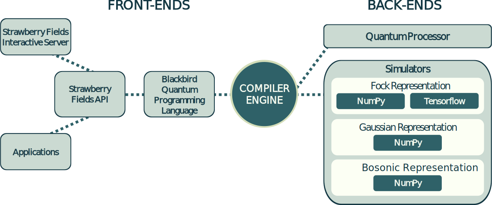

Strawberry Fields
#################

.. image:: https://img.shields.io/travis/XanaduAI/strawberryfields.svg?style=for-the-badge
    :alt: Travis
    :target: https://travis-ci.org/XanaduAI/strawberryfields

.. image:: https://img.shields.io/codecov/c/github/xanaduai/strawberryfields/master.svg?style=for-the-badge
    :alt: Codecov coverage
    :target: https://codecov.io/gh/XanaduAI/strawberryfields

.. image:: https://img.shields.io/codacy/grade/bd14437d17494f16ada064d8026498dd.svg?style=for-the-badge
    :alt: Codacy grade
    :target: https://app.codacy.com/app/XanaduAI/strawberryfields?utm_source=github.com&utm_medium=referral&utm_content=XanaduAI/strawberryfields&utm_campaign=badger

.. image:: https://img.shields.io/readthedocs/strawberryfields.svg?style=for-the-badge
    :alt: Read the Docs
    :target: https://strawberryfields.readthedocs.io

.. image:: https://img.shields.io/pypi/v/StrawberryFields.svg?style=for-the-badge
    :alt: PyPI
    :target: https://pypi.org/project/StrawberryFields

.. image:: https://img.shields.io/pypi/l/StrawberryFields.svg?style=for-the-badge
    :alt: PyPI - License
    :target: https://www.apache.org/licenses/LICENSE-2.0

.. image:: https://img.shields.io/pypi/pyversions/StrawberryFields.svg?style=for-the-badge
    :alt: PyPI - Python Version
    :target: https://pypi.org/project/StrawberryFields

Strawberry Fields is a full-stack Python library for designing,
simulating, and optimizing continuous variable (CV) quantum
optical circuits.

Features
========

* An open-source software architecture for **photonic quantum computing**

* A **full-stack** quantum software platform, implemented in Python specifically targeted to the CV model

* Quantum circuits are written using the easy-to-use and intuitive **Blackbird quantum programming language**

* Includes a suite of CV **quantum computer simulators** implemented using **NumPy** and **Tensorflow** - these built-in quantum compiler tools convert and optimize Blackbird code for classical simulation

* Future releases will aim to target experimental backends, including **photonic quantum computing chips**

Dependencies
============

Strawberry Fields depends on the following Python packages:

* `Python <http://python.org/>`_ >=3.5
* `NumPy <http://numpy.org/>`_  >=1.13.3
* `SciPy <http://scipy.org/>`_  >=1.0.0
* `NetworkX <http://networkx.github.io/>`_ >=2.0
* `Tensorflow <https://www.tensorflow.org/>`_ >=1.3

These can be installed using pip, or, if on linux, using your package manager (i.e. ``apt`` if on a Debian-based system.)

Installation
============

Installation of Strawberry Fields, as well as all required Python packages mentioned above, can be done using pip:
::

    $ python -m pip install strawberryfields

Software tests
==============

To ensure that Strawberry Fields is working correctly after installation, the test suite can be run by navigating to the source code folder and running
::

  make test

Note that this runs *all* of the tests, using *all* available backends, so can be quite slow (it should take around 40 minutes to complete). Alternatively, you can run the full test suite for a particular backend by running
::

  make test-[backend]

where ``[backend]`` should be replaced with the backend you would like to test (``fock``, ``tf``, or ``guassian``).

Individual test modules are run using
::

  python3 tests/test_gate.py --backend=[backend]

Documentation
=============

The Strawberry Fields documentation is built automatically and hosted at `Read the Docs <https://strawberryfields.readthedocs.io>`_.

To build the documentation locally, the following additional packages are required:

* `Sphinx <http://sphinx-doc.org/>`_ >=1.5
* `graphviz <http://graphviz.org/>`_ >=2.38
* `sphinxcontrib-bibtex <https://sphinxcontrib-bibtex.readthedocs.io/en/latest/>`_ >=0.3.6

If using Ubuntu, they can be installed via a combination of ``apt`` and ``pip``:
::

    $ sudo apt install graphviz
    $ pip3 install sphinx --user
    $ pip3 install sphinxcontrib-bibtex --user

To build the HTML documentation, go to the top-level directory and run the command
::

  $ make docs

The documentation can then be found in the ``doc/_build/html/`` directory.

Support
=======

- **Source Code:** https://github.com/XanaduAI/strawberryfields
- **Issue Tracker:** https://github.com/XanaduAI/strawberryfields/issues

If you are having issues, please let us know by posting the issue on our Github issue tracker.

License
=======

Strawberry Fields is **free** and **open source**, released under the Apache License, Version 2.0.