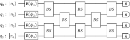

.. role:: html(raw)
   :format: html

.. _boson_sampling:

Boson sampling
==============

    "The extended Church-Turing thesis states that *'Any algorithmic process can be simulated efficiently using a probabilistic Turing machine'.* This ad-hoc modification of the Church-Turing thesis should leave you feeling rather queasy." - Nielsen and Chuang :cite:`nielsen2010`.

Introduced by Aaronson and Arkhipov :cite:`aaronson2013`, boson sampling presented a slight deviation from the general approach in quantum computation. Rather than presenting a theoretical model of universal quantum computation (i.e., a framework that enables quantum simulation of any arbitrary Hamiltonian :cite:`nielsen2010`), boson sampling-based devices are instead an example of an **intermediate quantum computer**, designed to experimentally implement a computation that is thought to be intractable classically :cite:`tillmann2013`.

Boson sampling proposes the following `quantum linear optics <https://en.wikipedia.org/wiki/Linear_optical_quantum_computing>`_ scheme. An array of single-photon sources is set up, designed to simultaneously emit single photon states into a multimode linear `interferometer <https://en.wikipedia.org/wiki/Interferometry>`_; the results are then generated by sampling from the probability of single photon measurements from the output of the linear interferometer.

For example, consider :math:`N` single photon Fock states, :math:`\ket{\psi}=\ket{m_1,m_2,\dots,m_N}`, composed of :math:`b=\sum_i m_i` photons, incident on an :math:`N`-mode linear interferometer, which performs the following linear transformation of the input mode creation and annihilations operators:

.. math::
    &\hat{a}^\dagger_{out_k} = \sum_{j=0}^N U_{kj}\hat{a}^\dagger_{in_j}\\
    &\hat{a}_{out_k} = \sum_{j=0}^N U_{jk}^\dagger\hat{a}_{in_j}

Here, the unitary :math:`U` completely describes the interferometer. Thus, the probability of detecting :math:`n_j` photons at the :math:`j\text{th}` output mode is given by

.. math:: \left|\braketT{n_1,n_2,\dots,n_N}{W}{\psi}\right|^2

where :math:`W` represents the action of :math:`U` on the Fock basis (:math:`W` is simply a homomorphism of :math:`U`). The remarkable nature of the boson sampling problem to challenge the extended Church-Turing thesis lies in the fact that :cite:`aaronson2013`

.. math:: \left|\braketT{n_1,n_2,\dots,n_N}{W}{\psi}\right|^2 = \frac{\left|\text{Per}(U_{st})\right|^2}{m_1!m_2!\cdots m_N!n_1!n_2!\cdots n_N!}

i.e., the sampled single photon probability distribution is proportional to the **permanent** of :math:`U_{st}`, a submatrix of the interferometer unitary, dependent upon the input and output Fock states.

.. note::

    The permanent of a matrix, defined by

    .. math:: \text{Per}(A) = \sum_{\sigma=S_N}\prod_{i=1}^N A_{i\sigma(i)}

    where :math:`S_N` is the set of all permutations of :math:`N` elements, is calculated in a similar fashion to the determinant, but unlike the determinant, the signatures of the permutations are not taken into account - every permutation is taken as a positive quantity.

    In graph theory, the permanent calculates the number of perfect `matchings <https://en.wikipedia.org/wiki/Matching_(graph_theory)>`_ in a `bipartite graph <https://en.wikipedia.org/wiki/Bipartite_graph>`_ with adjacency matrix :math:`A`.

Whilst the determinant can be calculated efficiently on classical computers, computing the permanent belongs to the computational complexity class of #P-Hard problems :cite:`valiant1979`, which are strongly believed to be classically hard to calculate. (Surprisingly, even calculating the permanent in an *approximate* manner is a member of #P and intractable classically).

This implies that simulating boson sampling cannot be done efficiently on a classical computer, providing a potential challenge to the extended Church-Turing thesis, and demonstrating the power of (non-universal) quantum computation.

CV implementation
------------------------------------

In quantum linear optics, the multimode linear interferometer is commonly decomposed into two-mode beamsplitters (:class:`~.BSgate`) and single-mode phase shifters (:class:`~.Rgate`) :cite:`reck1994`, allowing for a straightforward translation into a CV quantum circuit.

For example, in the case of a 4 mode interferometer, with arbitrary :math:`4\times 4` unitary :math:`U`, the quantum optics circuit is given by

:html:` `

:html:` `

In the above, the detectors perform Fock state measurements, and the parameters of the beamsplitters and the rotation gates determines the unitary :math:`U`. Note that, in order to allow for arbitrary linear unitaries for :math:`m` imput modes, we must have a minimum of :math:`m+1` columns in the beamsplitter array :cite:`clements2016`.

Blackbird code
---------------

The boson sampling circuit displayed above, with randomly chosen rotation angles and beamsplitter parameters, can be implemented using the Blackbird quantum circuit language:

.. literalinclude:: ../../examples/boson_sampling.py
   :language: python
   :linenos:
   :dedent: 4
   :tab-width: 4
   :start-after: with boson_sampling.context as q:
   :end-before: # end circuit

.. warning:: Currently, only the Fock backends (i.e., ``fock`` and ``tensorflow``) support boson sampling, as the Gaussian backend cannot initialise Fock states.

If we wish to simulate Fock measurements, we can additionally include

.. code-block:: python

    MeasureFock() | q

after the beamsplitter array. After constructing the circuit and running the engine, the values of the Fock state measurements will be available within the :attr:`samples` attribute of the :class:`~.Result` object returned by the engine.

Alternatively, you may omit the measurements, and extract the resulting Fock state probabilities directly via the state method :meth:`~.BaseFockState.all_fock_probs`.

.. note::
  A fully functional Strawberry Fields simulation containing the above Blackbird code is included at :download:`examples/boson_sampling.py <../../examples/boson_sampling.py>`.

  For more details on running the above Blackbird code in Strawberry Fields, including calculations of how to determine the output Fock state probabilities using the matrix permanent and comparisons to the returned state, refer to the in-depth :ref:`boson sampling tutorial <boson_tutorial>`.
