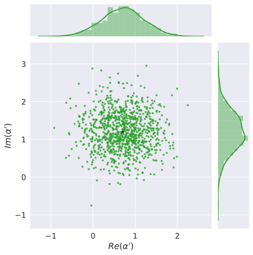

.. role:: html(raw)
   :format: html

.. _gaussian_cloning:

Gaussian cloning
####################

    "The natural  generalization  of  teleportation  to  the  many-recipient case" - van Loock :cite:`loock2001`

A fundamental concept in quantum mechanics, the `no-cloning theorem <https://en.wikipedia.org/wiki/No-cloning_theorem>`_ states that an unknown quantum state cannot be copied exactly :cite:`wootters1982` - in effect, ruling out any algorithm that attempts to produce or relies upon the production of perfect copies of an arbitrary quantum state :cite:`dieks1982`. Nevertheless, the no-cloning theorem does not rule out the production of *approximate* quantum state clones. This has led to the development of so called 'quantum cloning algorithms', unitary cloning transformations which provide identical copies of an arbitrary input state, at the cost of a non-unity fidelity.

CV implementation
====================

The first approximate cloning algorithm was introduced in the context of discrete-variable quantum computing by Buzek and Hillery :cite:`buek1996`, and quickly followed up with a CV implementation by Cerf et al. :cite:`cerf2000`. Here, a class of cloning machines  satisfying *displacement covariance* are introduced; that is, for two input states :math:`\ket{\psi}` and :math:`\ket{\phi}`, with approximate cloned states :math:`\ket{\psi'}` and :math:`\ket{\phi'}` respectively,

.. math:: D(\alpha)\ket{\psi}=\ket{\phi}~~~\Rightarrow~~~D(\alpha)\ket{\psi'}=\ket{\phi'}

In other words, cloning fidelity is **invariant** under displacements in the phase space, and the position and momentum uncertainties of the two clones satisfies the uncertainty inequality

.. math:: \Delta x_1\Delta p_2 \geq \frac{1}{2}\hbar

where :math:`\Delta x_1` is the :math:`x` quadrature variance of state :math:`\ket{\psi}` and :math:`\Delta p_2` is the :math:`p` quadrature variance of state :math:`\ket{\phi}`.

**Gaussian cloning algorithms**, those with the ability to produce two approximate and identical clones of the input state with theoretically optimum fidelity, are a subclass of the displacement covariant cloners that also exhibit **rotational covariance**. As a result, Gaussian cloning fidelity is invariant under both displacement and rotation in the phase space, and the resulting cloned states have identical :math:`x` and :math:`p` quadrature variances, :math:`\Delta x_1=\Delta p_1=\Delta x_2=\Delta p_2`. It is this subclass which is shown to be the CV equivalent to the universal qubit cloner of Buzek and Hillery :cite:`cerf2000`.

Circuit analysis
---------------------

Working within this framework, Andersen et al. :cite:`andersen2005` presented a symmetric Gaussian cloning algorithm (in addition to experimental results) for optimum theoretical cloning of coherent states:

:html:` `

.. image:: ../_static/cloning.svg
    :align: center
    :width: 70%
    :target: javascript:void(0);

:html:` `

Here, :math:`\ket{\alpha_0}` represents an input coherent state, :math:`\ket{\alpha'}_1` and :math:`\ket{\alpha'}_3` represent the two identical but approximate clones, and the beamsplitters are 50-50 beamsplitters (hence the 'symmetric' in symmetric cloning algorithm). Let's walk through the various stages of the circuit above, and examine what is occuring.

1. The action of a 50-50 beamsplitter on a coherent state :math:`\ket{\alpha}` and a vacuum state :math:`\ket{0}` is :math:`BS(\ket{\alpha}\otimes\ket{0}) = \ket{\frac{1}{\sqrt{2}}\alpha}\otimes \ket{\frac{1}{\sqrt{2}}\alpha}`. As such, after the two beamsplitters, the circuit exists in the following state:

   .. math:: \ket{\frac{1}{\sqrt{2}}\alpha_0}\otimes \ket{\frac{1}{2}\alpha_0}\otimes \ket{\frac{1}{2}\alpha_0}.

:html:` `

2. Performing the homodyne detection on modes :math:`q_1` and :math:`q_2` results in the two normally distributed measurement variables :math:`u` and :math:`v` respectively:

   .. math:: u\sim N\left(\sqrt{\frac{\hbar}{2}}\text{Re}(\alpha_0), \frac{\hbar}{2}\right), ~~~ v\sim N\left(\sqrt{\frac{\hbar}{2}}\text{Im}(\alpha_0), \frac{\hbar}{2}\right).

:html:` `

3. Two controlled displacements :math:`X(\sqrt{2}u)=D(u/\sqrt{\hbar})` and :math:`Z(\sqrt{2}v)=D(iv/\sqrt{\hbar})` are then performed on mode :math:`q_0`:

   .. math:: D\left(\frac{1}{\sqrt{\hbar}}(u+iv)\right)\ket{\frac{1}{\sqrt{2}}\alpha_0} = \ket{\frac{1}{\sqrt{2}}\alpha_0 + \frac{1}{\sqrt{\hbar}}(u+iv)} = \ket{\tilde{\alpha_0}}

   Since we are displacing a coherent state, the result of the controlled displacements remains a pure coherent state. However, since the parameters of the controlled displacements are themselves random variables, we must describe the resulting coherent state by a random variable :math:`\tilde{\alpha_0} \sim N(\mu, \text{cov})`.

   Here, :math:`\tilde{\alpha_0}` is randomly distributed as per a multivariate normal distribution with vector of means :math:`\mu=\sqrt{2}(\text{Re}(\alpha_0), \text{Im}(\alpha_0))` and covariance matrix :math:`\text{cov}=\I/2`.

:html:` `

4. Finally, we apply another beamsplitter to mode :math:`q_0` and mode :math:`q_3` in the vacuum state, to get our two cloned outputs:

   .. math:: BS(\ket{\tilde{\alpha_0}}\otimes\ket{0}) = \ket{\frac{1}{\sqrt{2}}\tilde{\alpha_0}}\otimes \ket{\frac{1}{\sqrt{2}}\tilde{\alpha_0}} = \ket{\alpha'}\otimes \ket{\alpha'}.

   where :math:`\alpha' \sim N(\mu, \text{cov}), ~~\mu=(\text{Re}(\alpha_0), \text{Im}(\alpha_0)), ~~\text{cov}=\I/4`.

Coherent average fidelity
------------------------------

If we were to perform the Guassian cloning circuit over an ensemble of identical input states :math:`\ket{\alpha_0}`, the cloned output can be described by the following mixed state,

.. math:: \rho = \iint d^2 \alpha' \frac{2}{\pi}e^{-2|\alpha'-\alpha_0|^2}\ket{\alpha'}\bra{\alpha'},

where the exponential term is the PDF of the random variable :math:`\alpha'` from (4) above. To calculate the average fidelity over the ensemble of the cloned states, it is sufficient to calculate the inner product

.. math:: F = \braketT{\alpha_0}{\rho}{\alpha_0}.

From the Fock basis decomposition of the coherent state (see :ref:`coherent_state`), it can be easily seen that :math:`|\braketD{\alpha_0}{\alpha'}|^2 = e^{-|\alpha_0-\alpha'|^2}`. Therefore,

.. math:: F = \frac{2}{\pi}\iint d^2 \alpha' e^{-2|\alpha'-\alpha_0|^2}|\braketD{\alpha_0}{\alpha'}|^2 = \frac{2}{\pi}\iint d^2 \alpha ~e^{-3|\alpha|^2} = \frac{2}{3},

where we have made the substitution :math:`\alpha=\alpha'-\alpha_0`. Note that the average fidelity is independent of the initial state :math:`\alpha_0`.

.. note:: The above is calculated in the case of unity quantum efficiency :math:`\eta=1`. When :math:`\eta<1`, there is non-zero uncertainty in the homodyne measurement, :math:`\sigma_H=\frac{1-\eta}{\eta}`, and in practice the symmetric Gaussian cloning scheme has coherent state average cloning fidelity given by

    .. math:: F(\sigma_H)=\frac{2}{3+\sigma_H}

    In the case of the Gaussian backend, :math:`\sigma_H=2\times 10^{-4}` (see :meth:`GaussianBackend.measure_homodyne <strawberryfields.backends.gaussianbackend.GaussianBackend.measure_homodyne>`).

Displaced squeezed states
------------------------------

In addition to coherent states, this cloning scheme was further analysed by Olivares et al. :cite:`olivares2006` in the cases of other Gaussian input states, such as squeezed states and thermal states. In particular, when the input Gaussian state is a **displaced squeezed state**,

.. math:: \ket{\psi} = \ket{\alpha,z} = D(\alpha)S(z)\ket{0},

this scheme provides an optimum fidelity of :math:`2/3` *only* if the squeezing parameter is known beforehand, as this allows the application of the unitary operation :math:`S(z)^{-1}` to recover a coherent state prior to cloning. Of course, this is not possible if we wish to clone an arbitrary unknown displaced squeezed state; in this case, the scheme described above leads to the following fidelity:

.. math:: F(r,\sigma_H) = \frac{4}{\sqrt{(6+2\sigma_H)^2+32(1+\sigma_H)\sinh^2(r)}}

where :math:`z=re^{i\phi}` and :math:`\sigma_H` is the uncertainty in the homodyne measurement. Note that :math:`F\rightarrow0` as :math:`r\rightarrow\infty`; i.e., the more highly squeezed the state, the lower the cloning fidelity.

Blackbird code
=================

The symmetric Gaussian cloning circuit displayed above can be implemented using the Blackbird quantum circuit language:

.. literalinclude:: ../../examples/gaussian_cloning.py
   :language: python
   :linenos:
   :dedent: 4
   :tab-width: 4
   :start-after: with gaussian_cloning.context as q:
   :end-before: # end circuit

After constructing the circuit and running the engine,

.. literalinclude:: ../../examples/gaussian_cloning.py
   :language: python
   :start-at: results =
   :end-at: ])

you can call the :ref:`state method <state_class>` :meth:`~.BaseState.fidelity_coherent`

.. literalinclude:: ../../examples/gaussian_cloning.py
   :language: python
   :start-at: fidelity =
   :end-at: ])

to calculate the fidelity of the cloned output compared to the input coherent state :math:`\alpha=0.7+1.2j`. (Note that we take the square root since the method is returning the fidelity of both modes multiplied).

Alternatively, if using the :ref:`gaussian_backend` as we are in this example, you can also use :meth:`~.BaseGaussianState.displacement` to return the displacements of the cloned states:

.. literalinclude:: ../../examples/gaussian_cloning.py
   :language: python
   :start-at: alpha =
   :end-at: )

Checking that they are identical clones up to numerical error:

>>> alpha[0] - alpha[1] <= 1e-15
True

In order to calculate the average fidelity over an ensemble, you will need to run the circuit multiple times, and calculate the mean fidelity over all runs:

.. literalinclude:: ../../examples/gaussian_cloning.py
   :language: python
   :start-at: reps =
   :end-at: displacement()

>>> np.mean(f)
0.6655095725825909
>>> np.mean(a)
0.707565976927201 + 1.2076413241970798j
>>> np.cov((a.real, a.imag))
[[ 0.24266768, -0.00805821],
 [-0.00805821,  0.26321192]]

Plotting the scatter plot of ``a.real`` vs. ``a.imag``, we see that they are indeed distributed as a multivariate normal distribution, with a mean of :math:`\sim 0.7+1.2j`, and covariance :math:`\sim I/4`:

:html:` `

:html:` `

.. note:: A fully functional Strawberry Fields simulation containing the above Blackbird code is included at :download:`examples/gaussian_cloning.py <../../examples/gaussian_cloning.py>`.
