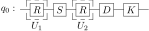
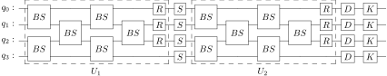

.. role:: html(raw)
    :format: html

.. _qnn:

Quantum neural network
======================

    "Neural Network are not black boxes. They are a big pile of linear algebra." - `Randall Munroe, xkcd <https://xkcd.com/1838/>`_

Machine learning has a wide range of models for tasks such as classification, regression, and clustering. Neural networks are one of the most successful models, having experienced a resurgence in use over the past decade due to increases in computational power and parallelization. The typical structure of a neural network consists of a series of interacting layers that perform transformations on data passing through the network. Here, the neural network depth is determined by the number of layers, while the maximum width is given by the layer with the greatest number of neurons.

An archetypal neural network structure is the feedforward neural network, visualized by the following example:

:html:` `

.. image:: ../_static/neural_network.svg
    :align: center
    :width: 85%
    :target: javascript:void(0);

:html:` `

The network begins with an input layer of real-valued neurons, which feed forward onto a series of one or more hidden layers. Following the notation of :cite:`killoran2018continuous`, if the :math:`n` neurons at one layer are given by the vector :math:`\mathbf{x} \in \mathbb{R}^{n}`, the :math:`m` neurons of the next layer take the values

.. math:: \mathcal{L}(\mathbf{x}) = \varphi (W \mathbf{x} + \mathbf{b}),

where :math:`W \in \mathbb{R}^{m \times n}` is a matrix, :math:`b \in \mathbb{R}^{m}` is a vector, and :math:`\varphi` is a nonlinear function (also known as the activation function). The matrix multiplication :math:`W \mathbf{x}` is a linear transformation on :math:`\mathbf{x}`, while :math:`W \mathbf{x} + \mathbf{b}` represents an **affine transformation**. In principle, any nonlinear function can be chosen for :math:`\varphi`, but often the choice is fixed from a `standard set of activations <https://en.wikipedia.org/wiki/Activation_function>`_ that include the rectified linear unit (ReLU) and the sigmoid function acting on each neuron. Finally, the output layer enacts an affine transformation on the last hidden layer, but the activation function may be linear (including the identity), or a different nonlinear function such as `softmax <https://en.wikipedia.org/wiki/Softmax_function>`_ (for classification).

Layers in the feedforward neural network above are called **fully connected** as every neuron in a given hidden or output layer can be connected to all neurons in the previous layer through the matrix :math:`W`. Over time, specialized versions of layers have been developed to focus on different problems. For example, convolutional layers have a restricted form of connectivity and are suited to machine learning with images. We focus here on fully connected layers as the most general type. Training of neural networks uses variations of the `gradient descent <https://en.wikipedia.org/wiki/Gradient_descent>`_ algorithm on a cost function characterizing the similarity between outputs of the neural network and training data. The gradient of the cost function can be calculated using automatic differentiation, with knowledge of the feedforward network structure.

Quantum neural networks aim to encode the neural network structure into a quantum system, with the intention of benefitting from quantum information processing. Nevertheless, there have been numerous attempts to define a quantum neural network and so far there is no clear consensus on the best approach. The quantum neural network detailed below, following the work of :cite:`killoran2018continuous`, has a CV architecture and is naturally realized using standard CV gates from Strawberry Fields.

CV implementation
------------------------------------

As with the boson sampling problem, the multimode linear interferometer can be decomposed into two-mode beamsplitters (:class:`~.BSgate`) and single-mode phase shifters (:class:`~.Rgate`) :cite:`reck1994`, allowing for a straightforward translation into a CV quantum circuit.

For example, in the case of a 4 mode interferometer, with arbitrary :math:`4\times 4` unitary :math:`U`, the CV quantum circuit for Gaussian boson sampling is given by

:html:` `

.. image:: ../_static/layer.svg
    :align: center
    :width: 70%
    :target: javascript:void(0);

:html:` `

In the above, the single mode squeeze states all apply identical squeezing :math:`z=r`, the parameters of the beamsplitters and the rotation gates determine the unitary :math:`U`, and finally the detectors perform Fock state measurements on the output modes. As with boson sampling, for :math:`N` input modes, we must have a minimum of :math:`N+1` columns in the beamsplitter array :cite:`clements2016`.

:html:` `

    One mode layer

:html:` `

    Two mode layer

:html:` `

    Three mode layer

:html:` `

    Four mode layer

:html:` `

Blackbird code
---------------

.. code-block:: python
    :linenos:

    def Interferometer(theta, phi, rphi, q):
        """Parameterised interferometer acting on N qumodes

        Args:
            theta (list): list of length N(N-1)/2 real parameters
            phi (list): list of length N(N-1)/2 real parameters
            rphi (list): list of length N-1 real parameters
            q (list): list of qumodes the interferometer is to be applied to
        """
        N = len(q)

        if N == 1:
            # the interferometer is a single rotation
            Rgate(rphi[0]) | q[0]
            return

        n = 0 # keep track of free parameters

        # Apply the rectangular beamsplitter array
        # The array depth is N
        for l in range(N):
            for k, (q1, q2) in enumerate(zip(q[:-1], q[1:])):
                # skip even or odd pairs depending on layer
                if (l+k)%2 != 1:
                    BSgate(theta[n], phi[n]) | (q1, q2)
                    n += 1

        # apply the final local phase shifts to all modes except the last one
        for i, p in enumerate(rphi):
            Rgate(p) | q[i]

The boson sampling circuit displayed above, with randomly chosen rotation angles and beamsplitter parameters, can be implemented using the Blackbird quantum circuit language:

.. literalinclude:: ../../examples/gaussian_boson_sampling.py
    :language: python
    :linenos:
    :dedent: 4
    :tab-width: 4
    :start-after: with eng:
    :end-before: # end circuit

If we wish to simulate Fock measurements, we can additionally include 

.. code-block:: python

    Measure | q[0]
    Measure | q[1]
    Measure | q[2]
    Measure | q[3]

after the beamsplitter array. After constructing the circuit and running the engine, the values of the Fock state measurements will be available in the attributes ``q[i].val`` for ``i=0,1,2,3``. In order to sample from this distribution, it will be required to repeat the execution of this circuit multiple times, storing the resulting measurements each time.

.. warning:: While all backends support the Gaussian boson sampling scheme, the Gaussian backend currently does not support the Fock state measurement operation :class:`.MeasureFock` (provided by the shortcut ``Measure``).

Alternatively, you may omit the measurements, and extract the resulting Fock state probabilities directly via the state methods :meth:`~.BaseFockState.all_fock_probs` (supported by Fock backends) or :meth:`~.BaseState.fock_prob` (supported by all backends).

.. note::
    A fully functional Strawberry Fields simulation containing the above Blackbird code is included at :download:`examples/gaussian_boson_sampling.py <../../examples/gaussian_boson_sampling.py>`. 

    For more details on running the above Blackbird code in Strawberry Fields, including calculations of how to determine the output Fock state probabilities using the matrix permanent and comparisons to the returned state, refer to the in-depth :ref:`Gaussian boson sampling tutorial <gaussian_boson_tutorial>`.
