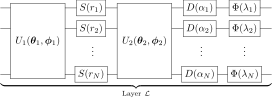

.. role:: html(raw)
    :format: html

.. _qnn:

Quantum neural network
======================

    "Neural Network are not black boxes. They are a big pile of linear algebra." - `Randall Munroe, xkcd <https://xkcd.com/1838/>`_

Machine learning has a wide range of models for tasks such as classification, regression, and clustering. Neural networks are one of the most successful models, having experienced a resurgence in use over the past decade due to improvements in computational power and advanced software libraries. The typical structure of a neural network consists of a series of interacting layers that perform transformations on data passing through the network. An archetypal neural network structure is the feedforward neural network, visualized by the following example:

:html:` `

:html:` `

Here, the neural network depth is determined by the number of layers, while the maximum width is given by the layer with the greatest number of neurons. The network begins with an input layer of real-valued neurons, which feed forward onto a series of one or more hidden layers. Following the notation of :cite:`killoran2018continuous`, if the :math:`n` neurons at one layer are given by the vector :math:`\mathbf{x} \in \mathbb{R}^{n}`, the :math:`m` neurons of the next layer take the values

.. math:: \mathcal{L}(\mathbf{x}) = \varphi (W \mathbf{x} + \mathbf{b}),

where

* :math:`W \in \mathbb{R}^{m \times n}` is a matrix,

* :math:`b \in \mathbb{R}^{m}` is a vector, and

* :math:`\varphi` is a nonlinear function (also known as the activation function).

The matrix multiplication :math:`W \mathbf{x}` is a linear transformation on :math:`\mathbf{x}`, while :math:`W \mathbf{x} + \mathbf{b}` represents an **affine transformation**. In principle, any nonlinear function can be chosen for :math:`\varphi`, but often the choice is fixed from a `standard set of activations <https://en.wikipedia.org/wiki/Activation_function>`_ that include the rectified linear unit (ReLU) and the sigmoid function acting on each neuron. Finally, the output layer enacts an affine transformation on the last hidden layer, but the activation function may be linear (including the identity), or a different nonlinear function such as `softmax <https://en.wikipedia.org/wiki/Softmax_function>`_ (for classification).

Layers in the feedforward neural network above are called **fully connected** as every neuron in a given hidden layer or output layer can be connected to all neurons in the previous layer through the matrix :math:`W`. Over time, specialized versions of layers have been developed to focus on different problems. For example, convolutional layers have a restricted form of connectivity and are suited to machine learning with images. We focus here on fully connected layers as the most general type.

Training of neural networks uses variations of the `gradient descent <https://en.wikipedia.org/wiki/Gradient_descent>`_ algorithm on a cost function characterizing the similarity between outputs of the neural network and training data. The gradient of the cost function can be calculated using `automatic differentiation <https://en.wikipedia.org/wiki/Automatic_differentiation>`_, with knowledge of the feedforward network structure.

Quantum neural networks aim to encode neural networks into a quantum system, with the intention of benefiting from quantum information processing. There have been numerous attempts to define a quantum neural network, each with varying advantages and disadvantages. The quantum neural network detailed below, following the work of :cite:`killoran2018continuous`, has a CV architecture and is realized using standard CV gates from Strawberry Fields. One advantage of this CV architecture is that it naturally accommodates for the continuous nature of neural networks. Additionally, the CV model is able to easily apply non-linear transformations using the phase space picture - a task which qubit-based models struggle with, often relying on measurement postselection which has a probability of failure.

CV implementation
------------------------------------

A CV quantum neural network layer can be defined as

.. math:: \mathcal{L} := \Phi \circ \mathcal{D} \circ \mathcal{U}_{2} \circ \mathcal{S} \circ \mathcal{U}_{1},

where

* :math:`\mathcal{U}_{k}=U_{k}(\boldsymbol{\theta}_{k},\boldsymbol{\phi}_{k})` is an :math:`N` mode interferometer,

* :math:`\mathcal{D}=\otimes_{i=1}^{N}D(\alpha_{i})` is a single mode displacement gate (:class:`~.Dgate`) with complex displacement :math:`\alpha_{i} \in \mathbb{C}`,

* :math:`\mathcal{S}=\otimes_{i=1}^{N}S(r_{i})` is a single mode squeezing gate (:class:`~.Sgate`) acting on each mode with squeezing parameter :math:`r_{i} \in \mathbb{R}`, and

* :math:`\Phi=\otimes_{i=1}^{N}\Phi(\lambda_{i})` is a non-Gaussian gate on each mode with parameter :math:`\lambda_{i} \in \mathbb{R}`.

.. note:: Any non-Gaussian gate such as the cubic phase gate (:class:`~.Vgate`) represents a valid choice, but we recommend the Kerr gate (:class:`~.Kgate`) for simulations in Strawberry Fields. The Kerr gate is more accurate numerically because it is diagonal in the Fock basis.

The layer is shown below as a circuit:

:html:` `

:html:` `

These layers can then be composed to form a quantum neural network. The width of the network can also be varied between layers :cite:`killoran2018continuous`.

Reproducing classical neural networks
~~~~~~~~~~~~~~~~~~~~~~~~~~~~~~~~~~~~~

Let's see how the quantum layer can embed the transformation :math:`\mathcal{L}(\mathbf{x}) = \varphi (W \mathbf{x} + \mathbf{b})` of a classical neural network layer. Suppose :math:`N`-dimensional data is encoded in position eigenstates so that

.. math:: \mathbf{x} \Leftrightarrow \ket{\mathbf{x}} := \ket{x_{1}} \otimes \ldots \otimes \ket{x_{N}}.

We want to perform the transformation

.. math:: \ket{\mathbf{x}} \Rightarrow \ket{\varphi (W \mathbf{x} + \mathbf{b})}.

It turns out that the quantum circuit above can do precisely this! Consider first the affine transformation :math:`W \mathbf{x} + \mathbf{b}`. Leveraging the singular value decomposition, we can always write :math:`W = O_{2} \Sigma O_{1}` with :math:`O_{k}` orthogonal matrices and :math:`\Sigma` a positive diagonal matrix. These orthogonal transformations can be carried out using interferometers without access to phase, i.e., with :math:`\boldsymbol{\phi}_{k} = 0`:

.. math:: U_{k}(\boldsymbol{\theta}_{k},\mathbf{0})\ket{\mathbf{x}} = \ket{O_{k} \mathbf{x}}.

On the other hand, the diagonal matrix :math:`\Sigma = {\rm diag}\left(\{c_{i}\}_{i=1}^{N}\right)` can be achieved through squeezing:

.. math:: \otimes_{i=1}^{N}S(r_{i})\ket{\mathbf{x}} \propto \ket{\Sigma \mathbf{x}},

with :math:`r_{i} = \log (c_{i})`. Finally, the addition of a bias vector :math:`\mathbf{b}` is done using position displacement gates:

.. math:: \otimes_{i=1}^{N}D(\alpha_{i})\ket{\mathbf{x}} = \ket{\mathbf{x} + \mathbf{b}},

with :math:`\mathbf{b} = \{\alpha_{i}\}_{i=1}^{N}` and :math:`\alpha_{i} \in \mathbb{R}`. Putting this all together, we see that the operation :math:`\mathcal{D} \circ \mathcal{U}_{2} \circ \mathcal{S} \circ \mathcal{U}_{1}` with phaseless interferometers and position displacement performs the transformation :math:`\ket{\mathbf{x}} \Rightarrow \ket{W \mathbf{x} + \mathbf{b}}` on position eigenstates.

.. warning:: The TensorFlow backend is the natural simulator for quantum neural networks in Strawberry Fields, but this backend cannot naturally accommodate position eigenstates, which require infinite squeezing. For simulation of position eigenstates in this backend, the best approach is to use a displaced squeezed state (:class:`prepare_displaced_squeezed_state <strawberryfields.backends.tfbackend.TFBackend.prepare_displaced_squeezed_state>`) with high squeezing value r. However, to avoid significant numerical error, it is important to make sure that all initial states have negligible amplitude for Fock states :math:`\ket{n}` with :math:`n\geq \texttt{cutoff_dim}`, where :math:`\texttt{cutoff_dim}` is the cutoff dimension.

Finally, the nonlinear function :math:`\varphi` can be achieved through a restricted type of non-Gaussian gates :math:`\otimes_{i=1}^{N}\Phi(\lambda_{i})` acting on each mode (see :cite:`killoran2018continuous` for more details), resulting in the transformation

.. math:: \otimes_{i=1}^{N}\Phi(\lambda_{i})\ket{\mathbf{x}} = \ket{\varphi(\mathbf{x})}.

The operation :math:`\mathcal{L} = \Phi \circ \mathcal{D} \circ \mathcal{U}_{2} \circ \mathcal{S} \circ \mathcal{U}_{1}` with phaseless interferometers, position displacements, and restricted non-Gaussian gates can hence be seen as enacting a classical neural network layer :math:`\ket{\mathbf{x}} \Rightarrow \ket{\phi(W \mathbf{x} + \mathbf{b})}` on position eigenstates.

Extending to quantum neural networks
~~~~~~~~~~~~~~~~~~~~~~~~~~~~~~~~~~~~

In fact, CV quantum neural network layers can be made more expressive than their classical counterparts. We can do this by lifting the above restrictions on :math:`\mathcal{L}`, i.e.:

- Using arbitrary interferometers :math:`U_{k}(\boldsymbol{\theta}_{k},\boldsymbol{\phi}_{k})` with access to phase and general displacement gates (i.e., not necessarily position displacement). This allows :math:`\mathcal{D} \circ \mathcal{U}_{2} \circ \mathcal{S} \circ \mathcal{U}_{1}` to represent a general Gaussian operation.
- Using arbitrary non-Gaussian gates :math:`\Phi(\lambda_{i})`, such as the Kerr gate.
- Encoding data outside of the position eigenbasis, for example using instead the Fock basis.

In fact, gates in a single layer form a universal gate set, making the CV quantum neural network a model for universal quantum computing, i.e., a sufficient number of layers can carry out any quantum algorithm implementable on a CV quantum computer.

CV quantum neural networks can be trained both through classical simulation and directly on quantum hardware. Strawberry Fields relies on classical simulation to evaluate cost functions of the CV quantum neural network and the resultant gradients with respect to parameters of each layer. However, this becomes an intractable task with increasing network depth and width. Ultimately, direct evaluation on hardware will likely be necessary to large scale networks; an approach for hardware-based training is mapped out in :cite:`schuld2019evaluating`. The `PennyLane <https://pennylane.readthedocs.io/en/latest/>`_ library provides tools for training hybrid quantum-classical machine learning models, using both simulators and real-world quantum hardware.

Example CV quantum neural network layers are shown, for one to four modes, below:

:html:` `

.. figure:: ../_static/layer_1mode.svg
    :align: center
    :width: 31%
    :target: javascript:void(0);

    One mode layer

:html:` `

.. figure:: ../_static/layer_2mode.svg
    :align: center
    :width: 46%
    :target: javascript:void(0);

    Two mode layer

:html:` `

.. figure:: ../_static/layer_3mode.svg
    :align: center
    :width: 75%
    :target: javascript:void(0);

    Three mode layer

:html:` `

.. figure:: ../_static/layer_4mode.svg
    :align: center
    :width: 90%
    :target: javascript:void(0);

    Four mode layer

:html:` `

Here, the multimode linear interferometers :math:`U_{1}` and :math:`U_{2}` have been decomposed into two-mode phaseless beamsplitters (:class:`~.BSgate`) and single-mode phase shifters (:class:`~.Rgate`) using the Clements decomposition :cite:`clements2016`. The Kerr gate is used as the non-Gaussian gate.

Blackbird code
---------------

The first step to writing a CV quantum neural network layer in Blackbird code is to define a function for the two interferometers:

.. literalinclude:: ../../examples/quantum_neural_network.py
   :language: python
   :linenos:
   :tab-width: 4
   :start-after: # define interferometer
   :end-before: # Rgate only applied to first N - 1 modes

.. warning:: The :class:`~.Interferometer` class in Strawberry Fields does not reproduce the functionality above. Instead, :class:`~.Interferometer` applies a given input unitary matrix according to the Clements decomposition.

Using the above ``interferometer`` function, an :math:`N` mode CV quantum neural network layer is given by the function:

.. literalinclude:: ../../examples/quantum_neural_network.py
   :language: python
   :linenos:
   :tab-width: 4
   :start-after: # define layer
   :end-before: # end layer

The variables fed into the gates of the layer are defined as TensorFlow variables. Multiple layers can then be joined into a network using:

.. code-block:: python

    with prog.context as q:

        for _ in range(layers):
            layer(q)

.. note::
    A fully functional Strawberry Fields simulation containing the above Blackbird code for state preparation is included at :download:`examples/quantum_neural_network.py <../../examples/quantum_neural_network.py>`.

Applications of CV quantum neural networks to `state learning <../gallery/state_learner/StateLearning.html>`_ and `gate synthesis <../gallery/gate_synthesis/GateSynthesis.html>`_ can be found in the Strawberry Fields gallery.
