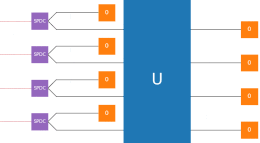

.. _gallery:

Gallery and links
#########################

Notebook gallery
----------------

Check out some cool applications of Strawberry Fields in the gallery below. Notebooks in the gallery have been contributed by the awesome Strawberry Fields community, and curated by the Strawberry Fields team 🍓.

.. Add the location of your Jupyter notebook below!

.. toctree::
   :maxdepth: 1
   :hidden:
   :titlesonly:

   minimizing_correlations/minimizing_correlations.ipynb
   state_learner/StateLearning.ipynb
   gate_synthesis/GateSynthesis.ipynb
   fibonacci_classifier/fibonacci_classifier.ipynb
   scattershot-boson-sampling/scattershot-bs.ipynb
   gate_visualisation/GateVisualisation.ipynb

.. Copy the template below in order to create a link to your notebook, and a thumbnail.

.. _Minimizing correlations: minimizing_correlations/minimizing_correlations.html
.. |mc| image:: minimizing_correlations/thumbnail.gif
   :width: 260px
   :align: middle
   :target: minimizing_correlations/minimizing_correlations.html

.. _Fibonacci classifier: fibonacci_classifier/fibonacci_classifier.html
.. |fc| image:: fibonacci_classifier/thumbnail.png
   :width: 260px
   :align: middle
   :target: fibonacci_classifier/fibonacci_classifier.html

.. _Quantum state learning: state_learner/StateLearning.html
.. |sl| image:: state_learner/thumbnail.gif
   :width: 260px
   :align: middle
   :target: state_learner/StateLearning.html

.. _Gate synthesis: gate_synthesis/GateSynthesis.html
.. |gs| image:: gate_synthesis/thumbnail.gif
   :width: 260px
   :align: middle
   :target: gate_synthesis/GateSynthesis.html

.. _Scattershot boson sampling: scattershot-boson-sampling/scattershot-bs.html

.. _Gate visualization: gate_visualisation/GateVisualisation.html
.. |gv| image:: gate_visualisation/thumbnail.gif
   :width: 260px
   :align: middle
   :target: gate_visualisation/GateVisualisation.html

.. Add your thumbnail to the table in the Gallery!

.. rst-class:: gallery-table

+-------------------------------+-------------------------------+------------------------------+
| |mc|                          | |sl|                          |   |gs|                       |
|                               |                               |                              |
| `Minimizing correlations`_    | `Quantum state learning`_     |   `Gate synthesis`_          |
+-------------------------------+-------------------------------+------------------------------+
| |gv|                          | |sbs|                         |                              |
|                               |                               |                              |
| `Gate visualization`_         | `Scattershot boson sampling`_ |                              |
+-------------------------------+-------------------------------+------------------------------+

Applications and plugins
------------------------

The following list of applications and plugins build on the Strawberry Fields framework; extending Strawberry Fields to allow it to tackle and solve new problems, or by providing an interface between other software frameworks.

* `PennyLane-SF <https://github.com/XanaduAI/Pennylane-SF>`_

  PennyLane is a machine learning library for optimization and automatic differentiation of hybrid quantum-classical computations.
  This plugin allows the Strawberry Fields backends to be used as PennyLane devices.

* `Quantum Machine Learning Toolbox <https://github.com/XanaduAI/QMLT>`_

  The Quantum Machine Learning Toolbox (QMLT) is a Strawberry Fields application that simplifies the optimization of variational quantum circuits. It provides helper functions commonly used in machine learning and optimization (such as for regularization), and includes a numerical learner, that can be used to optimize with the Gaussian and Fock backends.

* `SFOpenBoson <https://github.com/XanaduAI/SFOpenBoson>`_

  A plugin for Strawberry Fields and OpenFermion, SFOpenBoson integrates the photonic quantum circuit simulation capability of Strawberry Fields with the OpenFermion quantum chemistry package. This allows bosonic Hamiltonians defined in OpenFermion to be decomposed and simulated directly in Strawberry Fields.

External resources
------------------

In addition to the notebooks in the gallery, below are some external web resources that use or highlight Strawberry Fields.

.. Add your external blog post/application/GitHub page below!

* `Verifying continuous-variable Bell correlations <https://peterwittek.com/verifying-cv-bell-correlations.html>`_ - Peter Wittek

  *Explore how Strawberry Fields can be used to understand core concepts in quantum physics, such as the violation of the Bell inequalities.*

* `Quantum state learning and gate synthesis <https://github.com/XanaduAI/quantum-learning>`_ - Xanadu

  *A collection of scripts to automate the process of quantum state learning and gate synthesis using Strawberry Fields, based on the paper "Machine learning method for state preparation and gate synthesis on photonic quantum computers" (arXiv:1807.10781). Also included are some useful Python functions for generating well-known CV states and gates.*

* `Getting Started with Quantum Programming <https://hackernoon.com/an-interactive-tutorial-on-quantum-programming-327da388f859>`_ - Tanisha Bassan

  *The timeless game of battleships has been updated for the 21st century; Quantum Battleships, powered by Strawberry Fields.*

* `The World of Photonic Quantum Computing <https://medium.com/@briannagopaul/the-world-of-photonic-quantum-computing-4787a2b12649>`_ - Brianna Gopaul

  *See how Strawberry Fields can be used to visualize how the elementary CV gate set transforms the vacuum state.*

Research papers
----------------

Finally, some links to studies and research papers that utilize Strawberry Fields.

#. D\. Su, K. K. Sabapathy, C. R. Myers, H. Qi, C. Weedbrook, and K. Brádler. *Implementing quantum algorithms on temporal photonic cluster states.* `Physical Review A 98, 032316 <https://journals.aps.org/pra/abstract/10.1103/PhysRevA.98.032316>`_, 2018.

#. N\. Quesada, and A. M. Brańczyk. *Gaussian functions are optimal for waveguided nonlinear-quantum-optical processes.* `Phys. Rev. A 98, 043813 <https://journals.aps.org/pra/abstract/10.1103/PhysRevA.98.043813>`_, 2018.

#. N\. Killoran, T. R. Bromley, J. M. Arrazola, M. Schuld, N. Quesada, and S. Lloyd. *Continuous-variable quantum neural networks.* `arXiv:1806.06871 <https://arxiv.org/abs/1806.06871>`_, 2018.

#. J\. M\. Arrazola, T. R. Bromley, J. Izaac, C. R. Myers, K. Brádler, and N. Killoran. *Machine learning method for state preparation and gate synthesis on photonic quantum computers.* `Quantum Science and Technology, 4 024004 <https://iopscience.iop.org/article/10.1088/2058-9565/aaf59e>`_, 2019.

#. K\. K\. Sabapathy, H. Qi, J. Izaac, and C. Weedbrook. *Near-deterministic production of universal quantum photonic gates enhanced by machine learning.* `arXiv:1809.04680 <https://arxiv.org/abs/1809.04680>`_, 2018.

#. M\. Fingerhuth, T\. Babej, and P\. Wittek. *Open source software in quantum computing.* `PloS one, 13(12), e0208561 <https://journals.plos.org/plosone/article?id=10.1371/journal.pone.0208561>`_, 2018.

#. V\. Bergholm, J\. Izaac, M\. Schuld, C\. Gogolin, and N\. Killoran. *Pennylane: Automatic differentiation of hybrid quantum-classical computations.* `arXiv:1811.04968 <https://arxiv.org/abs/arXiv:1811.04968>`_, 2018.

#. N\. Quesada. *Franck-Condon factors by counting perfect matchings of graphs with loops.* `Journal of Chemical Physics, 150, 164113 <https://doi.org/10.1063/1.5086387>`_, 2019.

#. M\. Eaton, R\. Nehra, and O\. Pfister. *Gottesman-Kitaev-Preskill state preparation by photon catalysis.* `arXiv:1903.01925 <https://arxiv.org/abs/1903.01925>`_, 2019.

#. P\. H\. Qiu, X\. G\. Chen, and Y\. W\. Shi. *Solving Quantum Channel Discrimination Problem With Quantum Networks and Quantum Neural Networks.* `IEEE Access, 7, 50214-50222 <https://ieeexplore.ieee.org/abstract/document/8689007>`_, 2019.

#. C\. M\. Farrelly, S\. Namuduri, U\. Chukwu. *Quantum Generalized Linear Models.* `arXiv:1905.00365 <https://arxiv.org/abs/1905.00365>`_, 2019.

#. N\. Quesada, L\. G\. Helt, J\. Izaac, J\. M\. Arrazola, R\. Shahrokhshahi, C\. R\. Myers, and K\. K\. Sabapathy. *Simulating realistic non-Gaussian state preparation.* `arXiv:1905.07011 <https://arxiv.org/abs/1905.07011>`_, 2019.

#. W\. Hu, J\. Hu. *Training a quantum neural network to solve the contextual multi-armed bandit problem.* `Natural science, Vol.11 No.1 <https://www.scirp.org/journal/PaperInformation.aspx?PaperID=89983>`_, 2019.

#. A\. Pesah. *Learning quantum state properties with quantum and classical neural networks.* `Masters dissertation <http://kth.diva-portal.org/smash/record.jsf?pid=diva2%3A1320072&dswid=-438>`_, 2019.
