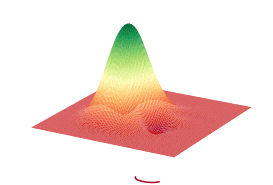

Strawberry Fields Documentation
###############################

.. rst-class:: lead grey-text ml-2

:Release: |release|

.. raw:: html

    
    

      

          </img>
      

      

        

            Strawberry Fields is a full-stack Python library for designing, optimizing, and
            utilizing photonic quantum computers.
        

      

    

    

    

        

            

                <a href="introduction/introduction.html">
                    

                        

                            

                                <h3 class="card-title pl-3 mt-4">
                                Using SF
                                </h3>
                                

                                    Learn how to interact with a photonic quantum computer <i class="fas fa-angle-double-right"></i>
                                

                            

                        

                    

                </a>
            

            

                <a href="development/development_guide.html">
                

                    

                        

                            <h3 class="card-title pl-3 mt-4">
                            Developing
                            </h3>
                            
How you can contribute to Strawberry Fields <i class="fas fa-angle-double-right"></i>

                        

                    

                

            </a>
            

            

                <a href="code/sf.html">
                

                    

                        

                            <h3 class="card-title pl-3 mt-4">
                            API
                            </h3>
                            
Explore the Strawberry Fields API <i class="fas fa-angle-double-right"></i>

                        

                    

                

            </a>
            

        

    

Features
========

* Execute photonic quantum algorithms directly on `Xanadu's next-generation quantum hardware
  <https://strawberryfields.ai/photonics/hardware/index.html>`__

..

* `High-level functions <https://strawberryfields.ai/photonics/applications.html>`__ for **solving
  practical problems** including **graph and network optimization**, **machine learning**, and
  **chemistry**

..

* Includes a suite of world-class simulators—based on cutting edge algorithms—to compile and
  simulate photonic algorithms

..

* `Train and optimize
  <https://strawberryfields.ai/photonics/demonstrations.html#optimization-and-machine-learning>`__
  your quantum programs with our end-to-end differentiable TensorFlow backend

How to cite
===========

If you are doing research using Strawberry Fields, please cite our papers:

  Nathan Killoran, Josh Izaac, Nicolás Quesada, Ville Bergholm, Matthew Amy, and Christian Weedbrook. "Strawberry Fields: A Software Platform for Photonic Quantum Computing", `Quantum, 3, 129 <https://quantum-journal.org/papers/q-2019-03-11-129/>`__ (2019).

  Thomas R. Bromley, Juan Miguel Arrazola, Soran Jahangiri, Josh Izaac, Nicolás Quesada, Alain Delgado Gran, Maria Schuld, Jeremy Swinarton, Zeid Zabaneh, and Nathan Killoran. "Applications of Near-Term Photonic Quantum Computers: Software and Algorithms", `arxiv:1912.07634 <https://arxiv.org/abs/1912.07634>`__ (2019).

Support
=======

- **Source Code:** https://github.com/XanaduAI/strawberryfields
- **Issue Tracker:** https://github.com/XanaduAI/strawberryfields/issues

If you are having issues, please let us know by posting the issue on our Github issue tracker.

To chat directly with the team designing and building Strawberry Fields, as well as members of our community—ranging from quantum computing researchers, to students, to those just interested in being a part of a rapidly growing industry—you can join our `discussion forum <https://discuss.pennylane.ai>`_ and `Slack channel <https://u.strawberryfields.ai/slack>`_.

For more details on contributing or performing research with Strawberry Fields, please see
:ref:`research`.

.. We have a mailing list located at: support@xanadu.ai

License
=======

Strawberry Fields is **free** and **open source**, released under the Apache License, Version 2.0.

.. toctree::
   :maxdepth: 1
   :caption: Using Strawberry Fields
   :hidden:

   introduction/introduction
   introduction/photonic_hardware
   introduction/circuits
   introduction/ops
   introduction/states
   introduction/data

.. toctree::
   :maxdepth: 1
   :caption: Development
   :hidden:

   development/development_guide
   development/migration_guides
   development/research
   development/release_notes.md

.. toctree::
   :maxdepth: 1
   :caption: API
   :hidden:

   code/sf
   code/sf_apps
   code/sf_backends
   code/sf_compilers
   code/sf_circuitdrawer
   code/sf_decompositions
   code/sf_engine
   code/sf_io
   code/sf_ops
   code/sf_parameters
   code/sf_program
   code/sf_program_utils
   code/sf_plot
   code/sf_tdm
   code/sf_utils
