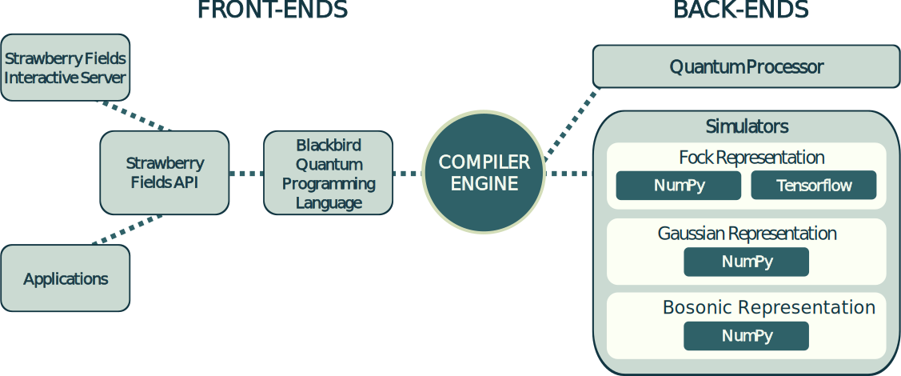

Strawberry Fields
#################

:Release: |release|
:Date: |today|

Strawberry Fields is a full-stack Python library for designing,
simulating, and optimizing continuous variable (CV) quantum
optical circuits.

Features
========

|

* An open-source software architecture for **photonic quantum computing**

.. 

* A **full-stack** quantum software platform, implemented in Python specifically targeted to the CV model

.. 

* Quantum circuits are written using the easy-to-use and intuitive **Blackbird quantum programming language**

.. 

* Powers the `Strawberry Fields Interactive <https://strawberryfields.ai>`_ web app, which allows anyone to run a quantum computing simulation via drag and drop.

.. 

* Includes a suite of CV **quantum computer simulators** implemented using **NumPy** and **Tensorflow** - these built-in quantum compiler tools convert and optimize Blackbird code for classical simulation

.. * Includes a **quantum machine learning toolbox**, built on top of the Tensorflow backend

* Future releases will aim to target experimental backends, including **photonic quantum computing chips**

Getting started
===============

To see Strawberry Fields in action immediately, try out our `Strawberry Fields Interactive <https://strawberryfields.ai>`_ web application. Prepare your initial states, drag and drop gates, and watch your simulation run in real time right in your web browser.

To get Strawberry Fields installed and running on your system, begin at the :ref:`download and installation guide <installation>`. Then, familiarize yourself with the framework of :ref:`continuous-variable quantum computation <introduction>`, the :ref:`conventions <conventions>` used by Strawberry Fields, and check out some important and interesting continuous-variable :ref:`quantum algorithms <algorithms>`.

For getting started with writing your own Strawberry Fields code, have a look at the :ref:`quantum teleportation tutorial <tutorial>` - this beginner's tutorial breaks down an example Strawberry Fields program for implementing state teleportation. More advanced tutorials also provided include :ref:`boson sampling <boson_tutorial>`, :ref:`gaussian boson sampling <gaussian_boson_tutorial>`, and :ref:`machine learning <machine_learning_tutorial>`.

Finally, detailed documentation on the :ref:`Strawberry fields API <code>` is provided, for full details on available quantum operations, arguments, and backends.

How to cite
===========

If you are doing research using Strawberry Fields, please cite `our whitepaper <https://arxiv.org/abs/1804.03159>`_:

  Nathan Killoran, Josh Izaac, Nicolás Quesada, Ville Bergholm, Matthew Amy, and Christian Weedbrook. Strawberry Fields: A Software Platform for Photonic Quantum Computing. *arXiv*, 2018. arXiv:1804.03159

Support
=======

- **Source Code:** https://github.com/XanaduAI/strawberryfields
- **Issue Tracker:** https://github.com/XanaduAI/strawberryfields/issues

If you are having issues, please let us know by posting the issue on our Github issue tracker, or by joining our `Strawberry Fields Slack channel <https://u.strawberryfields.ai/slack>`_.

For more details on contributing or performing research with Strawberry Fields, please see
:ref:`research`.

.. We have a mailing list located at: support@xanadu.ai

License
=======

Strawberry Fields is **free** and **open source**, released under the Apache License, Version 2.0.

.. toctree::
   :maxdepth: 2
   :caption: Getting started
   :hidden:

   installing
   research

.. toctree::
   :maxdepth: 2
   :caption: Continuous-variable quantum computing
   :hidden:

   introduction
   op_conventions
   quantum_algorithms
   references

.. toctree::
   :maxdepth: 2
   :caption: Strawberry Fields Tutorials
   :hidden:

   tutorials/blackbird
   Basic tutorial: teleportation <tutorials/tutorial_teleportation>
   Measurements and post-selection <tutorials/tutorial_post_selection>
   Boson sampling & the permanent <tutorials/tutorial_boson_sampling>
   Gaussian boson sampling & the hafnian <tutorials/tutorial_gaussian_boson_sampling>
   Optimization & machine learning <tutorials/tutorial_machine_learning>

.. toctree::
   :maxdepth: 2
   :caption: Strawberry Fields API
   :hidden:

   code/code
   code/engine
   code/ops
   code/utils
   code/backend
   code/backend.states
   code/backend.gaussian
   code/backend.fock
   code/backend.tf

Indices and tables
==================

* :ref:`genindex`
* :ref:`modindex`
* :ref:`search`
