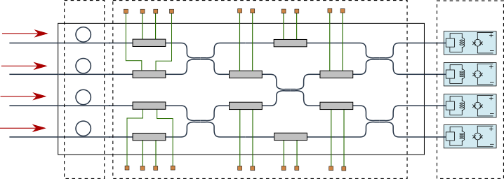
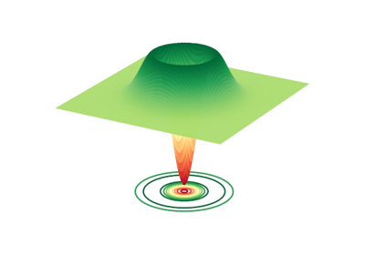
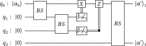
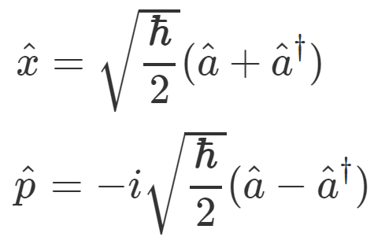

Introduction to quantum photonics
=================================

.. role:: html(raw)
   :format: html

Use this section to gain an understanding of photonic quantum computing and as a reference guide
when using Strawberry Fields.

Near-term device
----------------

The near-term device available for photonic quantum computing has a fixed architecture with
controllable gates. This architecture realizes an algorithm known as **Gaussian boson sampling**
(GBS), which can be **programmed to solve a range of practical tasks** such as :ref:`graph
optimization <graphs-intro>`, :ref:`machine learning <ml-intro>` and :ref:`chemistry calculations
<chemistry-intro>`.

A GBS device can be programmed to embed any symmetric matrix. Read this section for further
details on GBS without needing to dive deeper into quantum computing!

.. raw:: html

    <a href="intro_photonics/gbs_intro.html">
    <h5>read more <i class="fas fa-angle-double-right"></i></h5>
    </a>

.. toctree::
   :maxdepth: 2
   :hidden:

   intro_photonics/gbs_intro

Photonic quantum computers
--------------------------

Photonic quantum systems are described by a slightly different model to that of qubits. The basic
elements of a photonic system are **qumodes**, each of which can be described by a superposition
over different numbers of photons. This model leads to a different set of quantum gates and
measurements. In the long term, the photonic and qubit-based approaches **will be able to run the
same set of established quantum algorithms**. On the other hand, near-term photonic and qubit
systems are expected to have their own strengths and weaknesses.

Read this section to get to grips with the photonic model of quantum computing and see how it
contrasts with the qubit model.

.. raw:: html

    <a href="intro_photonics/introduction.html">
    <h5>read more <i class="fas fa-angle-double-right"></i></h5>
    </a>

.. toctree::
   :maxdepth: 2
   :hidden:

   intro_photonics/introduction

Quantum algorithms
------------------

Photonic quantum algorithms have been established for a number of protocols, including
**teleportation**, **Hamiltonian simulation** and **quantum neural networks**. This section covers
the technical details of these quantum algorithms and shows how they can be implemented in
Strawberry Fields.

.. raw:: html

    <a href="intro_photonics/quantum_algorithms.html">
    <h5>read more <i class="fas fa-angle-double-right"></i></h5>
    </a>

.. toctree::
   :maxdepth: 2
   :hidden:

   intro_photonics/quantum_algorithms

Conventions and formulas
------------------------

Describing a quantum system requires a number of conventions to be fixed, including the infamous
value of Planck's constant :math:`\hbar` (we set :math:`\hbar=2` by default)! This section
details formulae and constants used throughout Strawberry Fields and can be used for reference
when constructing quantum circuits.

.. raw:: html

    <a href="intro_photonics/op_conventions.html">
    <h5>read more <i class="fas fa-angle-double-right"></i></h5>
    </a>

.. toctree::
   :maxdepth: 2
   :hidden:

   intro_photonics/op_conventions
