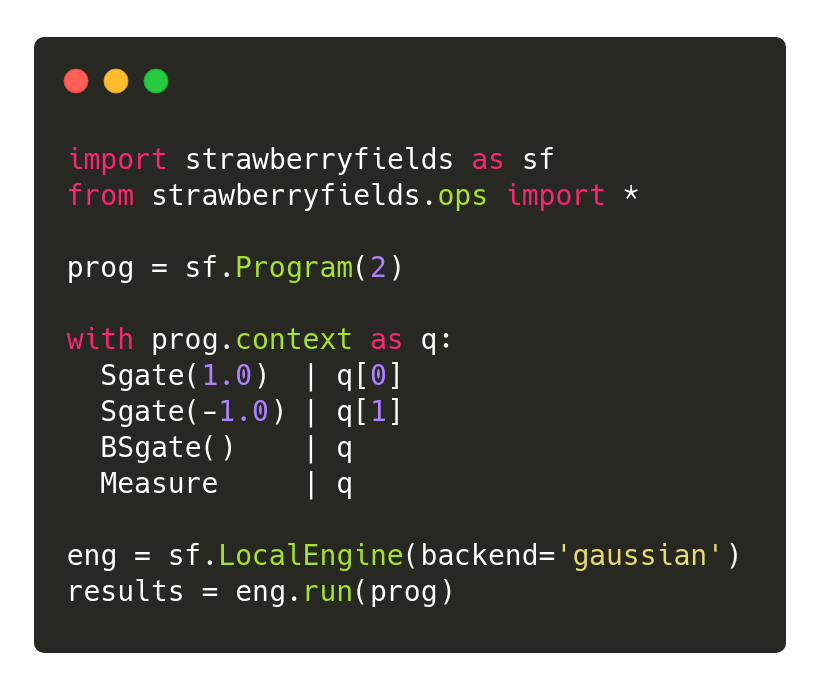

Introduction
============

.. image:: /_static/NOON.png
    :align: right
    :width: 250px
    :target: javascript:void(0);

Strawberry Fields is an open-source framework for photonic quantum computing.
In particular, Strawberry Fields allows for the following workflows:

* Construct and simulate continuous-variable quantum photonic circuits.
  Provided simulators include highly optimized Gaussian, Fock, and Bosonic
  numeric backends, as well as a TensorFlow backend for backpropagation.

* Compile and submit photonic circuits for remote execution on Xanadu's quantum hardware,
  retrieve your results, and manage multiple jobs.

* Use our high-level functions for graph and network optimization, machine learning, and
  chemistry applications --- all executable on near-term hardware.

Get started
-----------

Follow the `installation <../_static/install.html>`_ page to get Strawberry Fields up and
running, then have a look at our quickstart guides, or jump over to the
:doc:`tutorials <demonstrations>` to see what you can do with Strawberry Fields.

Users interested in applications of photonic quantum computers should check
out the :doc:`applications` pages. Those wanting to dig deeper into the design
of circuits can head to the :doc:`/introduction/circuits` page.

Developers can head to the :doc:`/development/development_guide` to see how
they can contribute to Strawberry Fields.

Quickstart guides
-----------------

In the following sections you can learn more about the key features of Strawberry Fields:

1. :doc:`circuits` shows how to construct and simulate photonic circuits in Strawberry Fields,
   including applying quantum gates, performing measurements, and how to use our various
   simulator backends.

..

2. :doc:`ops` outlines the various quantum photonic circuit building blocks
   provided in Strawberry Fields  --- including gates, state preparations and measurements.

..

4. :doc:`states` outlines the various statevector methods and attributes accessible
   when using the built-in simulators. These provide useful information and processing
   of the quantum state of the system.

..

5. :doc:`photonic_hardware` gives an overview of building, submitting, and managing
   remote jobs on both hardware and cloud simulators through Strawberry Fields.

..

6. :doc:`data` details the built-in datasets of pre-generated photonic samples provided
   by Strawberry Fields, for various graphs used in optimization, machine learning, and chemistry
   applications.
