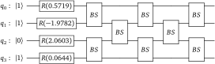

.. _boson_tutorial:

Boson sampling tutorial
#######################

.. sectionauthor:: Josh Izaac <josh@xanadu.ai>

.. role:: html(raw)
   :format: html

.. highlight:: pycon

In this short tutorial, we will walk through the application of the boson sampling Blackbird example provided in the :ref:`boson_sampling` section of the :ref:`algorithms` page. Be sure to read through that section to familiarize yourself with the concepts behind boson sampling, as well as the introductory :ref:`teleportation tutorial <tutorial>`, before attempting this tutorial.

Circuit construction and simulation
====================================

A 4-mode boson sampling circuit is given by

:html:` `

Simulating this circuit using Strawberry Fields is easy; we can simply read off the gates from left to right, and convert it into the Blackbird circuit language.

To begin, create a new text file with the name :file:`boson_sampling.py`, and open it with an editor. Copy and paste the following Strawberry Fields code:

.. literalinclude:: ../../examples/boson_sampling.py
    :language: python

.. note:: This example program is included with Strawberry Fields as :download:`examples/boson_sampling.py <../../examples/boson_sampling.py>`.

A couple of things to note in this particular example:

..

1. We initialize the input state :math:`\ket{\psi} = \ket{1,1,0,1}`, by creating a single photon Fock state in modes 0, 1 and 3. This is done via the :class:`~.Fock` operator. Mode 2 is initialized as a vacuum state using the ``Vac`` operator (a shortcut to :class:`~.Vacuum`). This is *optional* - modes are automatically created in the vacuum state upon engine initialization.

..

2. Next we apply the rotation gates, :class:`~.Rgate`, to each mode. The resulting rotation in the phase space occurs in the anticlockwise direction, with angle :math:`\phi`.

..

3. Finally, we apply the array of beamsplitters, using the :class:`~.BSgate` operator, with arguments ``(theta,phi)``.

   * The transmission amplitude is then given by :math:`t=\cos\theta`
   * The reflection amplitude is given by :math:`r=e^{i\phi}\sin{\theta}`

..

4. The rotation gate and beamsplitter parameters have been chosen at random, leading to an arbitrary unitary :math:`U` acting on the input modes annihilation and creation operators. After leaving the beamsplitter array, we will denote the output state by :math:`\ket{\psi'}`.

..

5. As only Fock backends support boson sampling, we are using the :ref:`numpy_backend`, indicated with the argument ``'fock'``, along with a 4 mode register and a Fock state truncation/cutoff dimension of 7 (i.e., all information of quantum amplitudes of Fock states :math:`\ket{n}`, :math:`n\geq 7`, is discarded).

..

6. We are **not** performing Fock measurements at the output; this is to ensure the state is preserved, so we can extract the joint Fock state probabilities after the beamsplitter array.

   The state method :meth:`~.BaseFockState.all_fock_probs` returns a :math:`\overbrace{D\times D\times\cdots\times D}^{\text{num modes}}` array, where :math:`D` is the Fock basis cutoff truncation, containing the marginal Fock state probabilities - in this example, it would have dimension :math:`7\times 7\times 7\times 7`. We can then access the probability of measuring a particular output state by indexing. For example,

   .. math:: \texttt{probs[1, 1, 1, 0]} = \left|\braketD{1,1,1,0}{\psi'}\right|^2

After saving the file, you can then run the simulation by executing on the command line:

.. code-block:: bash

    $ python3 boson_sampling.py

Calculating the unitary
========================

To explore further, add the following line to the bottom of the file :file:`boson_sampling.py` and re-run it (alternatively, you can run the full program in an interactive shell/notebook):

.. code-block:: python

    np.save('boson_fock_output', probs)

You should now have the file :file:`boson_fock_output.npy` in the same directory containing the joint Fock state probabilities of the output modes; to analyze these results, it is convenient to now move to a Python console or interactive environment, such as `iPython <https://ipython.org/>`_ or `Jupyter Notebook <http://jupyter.org/>`_. In the following, Python input will be specified with the prompt ``>>>``, and output will follow.

First, import some useful libraries, such as NumPy, as well as the ``multi_dot`` and ``block_diag`` functions from NumPy and SciPy respectively, and load the Fock state probabilities::

>>> import numpy as np
>>> from numpy.linalg import multi_dot
>>> from scipy.linalg import block_diag
>>> probs = np.load('boson_fock_output.npy')

To start with, let's generate the matrix representing the unitary transformation of the input mode annihilation and creation operators. The rotation gates simply act as follows,

.. math:: R(\phi)\hat{a} = \hat{a}e^{i\phi},

and thus the column of rotation gates has the following block diagonal form:

.. math::
    U_\phi = \left[\begin{matrix}
            e^{i\phi_1} & 0 & \cdots\\
            0 & e^{i\phi_2}  & \cdots \\
            \vdots & \vdots & \ddots \\
        \end{matrix}\right]

Generating this in NumPy:

>>> Uphase = np.diag([np.exp(0.5719*1j),np.exp(-1.9782*1j),np.exp(2.0603*1j),np.exp(0.0644*1j)])

A single beamsplitter, acting on two input modes :math:`(\hat{a}_1,\hat{a}_2)`, instead acts as follows:

.. math::
    BS(\theta, \phi) (\hat{a}_1,\hat{a}_2) = \left[\begin{matrix}
            t & -r^*\\
            r & t\\
        \end{matrix}\right] \left[\begin{matrix}
            \hat{a}_1\\
            \hat{a}_2
        \end{matrix}\right]

where :math:`t=\cos(\theta)` and :math:`r=e^{i\phi}\sin(\theta)`. Again, like the rotation gate, they combine as block diagonal matrices.

First of all, we need to convert the ``BSgate`` arguments, ``theta`` and ``phi`` (reproduced below for convenience),

>>> BSargs = [
...     (0.7804, 0.8578),
...     (0.06406, 0.5165),
...     (0.473, 0.1176),
...     (0.563, 0.1517),
...     (0.1323, 0.9946),
...     (0.311, 0.3231),
...     (0.4348, 0.0798),
...     (0.4368, 0.6157)
... ]

into transmission and reflection amplitudes :math:`t` and :math:`r`:

>>> t_r_amplitudes = [(np.cos(q), np.exp(p*1j)*np.sin(q)) for q,p in BSargs]

Next, we generate the individual beamsplitter unitary transformations,

>>> BSunitaries = [np.array([[t, -np.conj(r)], [r, t]]) for t,r in t_r_amplitudes]

before using the SciPy function :py:func:`scipy.linalg.block_diag` to calculate the resulting :math:`U_{BS_i}`, i.e., the unitary corresponding to each column of 'independent' beamsplitters in the above circuit diagram:

>>> UBS1 = block_diag(*BSunitaries[0:2])
>>> UBS2 = block_diag([[1]], BSunitaries[2], [[1]])
>>> UBS3 = block_diag(*BSunitaries[3:5])
>>> UBS4 = block_diag([[1]], BSunitaries[5], [[1]])
>>> UBS5 = block_diag(*BSunitaries[6:8])

Finally, we combine the unitaries to form a single :math:`4\times 4` unitary via matrix multiplication; :math:`U = U_{BS_5}U_{BS_4}U_{BS_3}U_{BS_2}U_{BS_1}U_{\phi}`. Since :func:`numpy.dot` only supports matrix multiplication of two arrays, we instead use :func:`numpy.linalg.multi_dot`:

>>> U = multi_dot([UBS5, UBS4, UBS3, UBS2, UBS1, Uphase])

We find that

.. math::
    U = \left[\begin{matrix}
        0.2195-0.2565i & 0.6111+0.5242i & -0.1027+0.4745i & -0.0273+0.0373i\\
        0.4513+0.6026i & 0.4570+0.0123i & 0.1316-0.4504i & 0.0353-0.0532i\\
        0.0387+0.4927i & -0.0192-0.3218i & -0.2408+0.5244i & -0.4584+0.3296i\\
        -0.1566+0.2246i & 0.1100-0.1638i & -0.4212+0.1836i & 0.8188+0.068i
    \end{matrix}\right]

Analysis
=========

Now that we have the interferometer unitary transformation :math:`U`, as well as the 'experimental' results, let's compare the two, and see if the boson sampling result,

.. math:: \left|\braketD{n_1,n_2,\dots,n_N}{\psi'}\right|^2 = \frac{\left|\text{Perm}(U_{st})\right|^2}{m_1!m_2!\cdots m_N!n_1!n_2!\cdots n_N!},

holds. First, import the Strawberry Fields generated joint Fock state probability data:

>>> probs = np.loadtxt('boson_fock_output.txt')

For this example, we'll consider the output state :math:`\ket{2,0,0,1}`. Extracting :math:`\left|\braketT{2,0,0,1}{\psi'}\right|^2` from the output data, we see that

>>> probs[2,0,0,1]
0.10644192724642336

Before we can calculate the right-hand-side of the equation, we need a method of calculating the permanent. Since the permanent is classically hard to compute, it is not provided in either NumPy *or* SciPy, so we will use `The Walrus <https://the-walrus.readthedocs.io>`_ library, installed alongside Strawberry Fields:

>>> from thewalrus import perm

Finally, how do we determine the submatrix :math:`U_{st}`? This isn't too hard :cite:`tillmann2013`; first, we calculate the submatrix :math:`U_s` by taking :math:`m_k` copies of the :math:`k\text{th}` **columns** of :math:`U`, where :math:`m_k` is the photon number of the :math:`k\text{th}` input state.

Since our input state is :math:`\ket{\psi}=\ket{1,1,0,1}`, we simply take single copies of the first, second, and fourth columns:

>>> U[:,[0,1,3]]

Next, we take :math:`n_k` copies of the :math:`k\text{th}` **row** of :math:`U_s`, where :math:`n_k` is the photon number of the :math:`k\text{th}` **output** state that is measured. Here, our measurement is :math:`\ket{2,0,0,1}\bra{2,0,0,1}` so we take two copies of the first row, and one copy of the last row:

>>> U[:,[0,1,3]][[0,0,3]]

Now, using the permanent function we defined above, we can take the absolute value squared of the permanent. Finally, we divide by the product of the input and output state number factorials. Since :math:`0!=1!=1`, we only need to take into account the case :math:`2!=2`:

>>> np.abs(perm(U[:,[0,1,3]][[0,0,3]]))**2 / 2
0.10644192724642332

Comparing this to the result from Strawberry Fields, we can see that they only differ at the **17th decimal point**. Calculating the exact percentage difference,

>>> BS = np.abs(perm(U[:,[0,1,3]][[0,0,3]]))**2 / 2
>>> SF = probs[2,0,0,1]
>>> 100*np.abs(BS-SF)/BS
3.9113688093093357e-14

They agree with almost negligable error! This is due to the high accuracy of the Fock backend, despite the Fock state truncation/cutoff.

    This close result stands for any other output Fock state measurement that preserves the photon number, for example:

    * :math:`\ket{3,0,0,0}\bra{3,0,0,0}`:

    >>> probs[3,0,0,0]
    0.00094584833471324822
    >>> np.abs(perm(U[:,[0,1,3]][[0,0,0]]))**2 / 6
    0.00094584833471324887

    * :math:`\ket{1,1,0,1}\bra{1,1,0,1}`:

    >>> probs[1,1,0,1]
    0.17468916048563926
    >>> np.abs(perm(U[:,[0,1,3]][[0,1,3]]))**2 / 1
    0.17468916048563934

.. note::

    Although returning only an **approximation** of the Fock state joint probability, and thus only approximating the various submatrix permanents, the Fock backends are still computing a classically intractable problem.

    This is because approximating the matrix permanent remains a countably hard classical problem.
