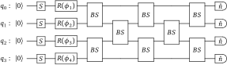

.. _gaussian_boson_tutorial:

Gaussian boson sampling tutorial
#################################

.. sectionauthor:: Josh Izaac <josh@xanadu.ai>

.. role:: html(raw)
   :format: html

.. highlight:: pycon

.. note:: This tutorial is also available in the form of an interactive Jupyter Notebook :download:`GaussianBosonSampling.ipynb <../../examples/GaussianBosonSampling.ipynb>`

In this short tutorial, we will walk through the application of the Gaussian boson sampling Blackbird example provided in the :ref:`gaussian_algorithm` section of the :ref:`algorithms` page. Be sure to read through that section to familiarise yourself with the concepts behind Gaussian boson sampling, as well as the introductory :ref:`teleportation tutorial <tutorial>`, before attempting this tutorial. It is also strongly recommended to read the :ref:`boson sampling tutorial <boson_tutorial>`, which introduces a few concepts also used in Gaussian boson sampling.

Circuit construction and simulation
====================================

A 4-mode Gaussian boson sampling circuit is given by

:html:` `

Simulating this circuit using Strawberry Fields is easy; we can simply read off the gates from left to right, and convert it into the Blackbird circuit language.

To begin, create a new text file with the name :file:`gaussian_boson_sampling.py`, and open it with an editor. Copy and paste the following Strawberry Fields code:

.. literalinclude:: ../../examples/gaussian_boson_sampling.py
  :language: python3

.. note:: This example program is included with Strawberry Fields as :download:`examples/gaussian_boson_sampling.py <../../examples/gaussian_boson_sampling.py>`.

A couple of things to note in this particular example:

..

1. To prepare the input single mode squeezed vacuum state :math:`\ket{z}` where :math:`z = 1`,
   we apply a squeezing gate :class:`~.Sgate` to each of the modes (initially in the vacuum state).

..

2. Next we apply the linear interferometer to all four modes, using the decomposition operator :class:`~.Interferometer`, and the unitary matrix ``U``. This operator decomposes the unitary matrix representing the linear interferometer into single mode rotation gates :class:`~.Rgate`, and two-mode beamsplitters :class:`~.BSgate`. After applying the interferometer, we will denote the output state by :math:`\ket{\psi'}`.

   .. note:: You can view the decomposed beamsplitters and rotation gates which correspond to the linear interferometer ``U`` by calling :meth:`eng.print_applied() <strawberryfields.engine.Engine.print_applied>` after running the engine.

   .. note:: The interferometer applied here is **identical** to that from the :ref:`boson sampling tutorial <boson_tutorial>`. As a result, the decomposed beamsplitter and rotation gate parameters will also be identical.

..

3. Unlike the :ref:`boson sampling tutorial <boson_tutorial>`, the lack of Fock states means we can now use the :ref:`gaussian_backend`, indicated with the argument ``'gaussian'``, along with a 4-mode register. The Gaussian backend is perfectly suited for simulation of Gaussian boson sampling, as all initial states are Gaussian, and all the required operators transform Gaussian states to other Gaussian states.

..

4. We are **not** performing Fock measurements at the output; this is to ensure the state is preserved, so we can extract the joint Fock state probabilities after the beamsplitter array.

   The state method :meth:`~.BaseState.fock_prob` accepts a list or a tuple containing the Fock state to be measured and returns the probability of that measurement. For example, ``[1,2,0,1]`` represents the measurement resulting in the detection of 1 photon at mode ``q[0]`` and mode ``q[3]``, and 2 photons at mode ``q[1]``, and would return the value

   .. math:: \text{prob}(1,2,0,1) = \left|\braketD{1,2,0,1}{\psi'}\right|^2

   The Fock state method :meth:`~.BaseFockState.all_fock_probs`, used previously to return *all* Fock state probabilities as an array, is **not supported** by the Gaussian backend. This is because computing the Fock probabilities of states in the Gaussian representation has exponential scaling - while this is fine for computing particular Fock basis probabilities, it becomes computationally demanding to return *all* Fock state probabilities using the Gaussian backend.

The simulation can be run by executing the file from the command line, resulting in the following output:

.. code-block:: bash

    $ python3 gaussian_boson_sampling.py
    |0000>: 0.176378447614135
    |1100>: 0.0685595637122246
    |0101>: 0.002056097258977398
    |1111>: 0.00834294639986785
    |2000>: 0.01031294525345511

Equally squeezed inputs
=============================

Recall that, as shown in Ref. :cite:`hamilton2017` and reviewed in the :ref:`Gaussian boson sampling section <gaussian_algorithm>` of the quantum algorithms page, the formula for calculating the output Fock state probability,

.. math:: \left|\left\langle{n_1,n_2,\dots,n_N}\middle|{\psi'}\right\rangle\right|^2 = \frac{\left|\text{Haf}[(U\bigoplus_i\tanh(r_i)U^T)]_{st}\right|^2}{n_1!n_2!\cdots n_N! \cosh(r_i)}

where :math:`U` is the rotation/beamsplitter unitary transformation on the input and output mode annihilation and creation operators.

However, in this particular example, we are using **the same** squeezing parameter, :math:`z=r`, for all input states - this allows us to simplify this equation. To start with, the hafnian expression simply becomes :math:`\text{Haf}[(UU^T\tanh(r))]_{st}`, removing the need for the tensor sum.

Thus, we have

.. math:: \left|\left\langle{n_1,n_2,\dots,n_N}\middle|{\psi'}\right\rangle\right|^2 = \frac{\left|\text{Haf}[(UU^T\tanh(r))]_{st}\right|^2}{n_1!n_2!\cdots n_N!\cosh^N(r)}.

Analysis
=========

To analyse the results, it is convenient to now move to a Python console or interactive environment, such as `iPython <https://ipython.org/>`_ or `Jupyter Notebook <http://jupyter.org/>`_. In the following, Python input will be specified with the prompt ``>>>``, and output will follow.

First, import some useful libraries, such as NumPy, as well as the ``multi_dot`` and ``block_diag`` functions from NumPy and SciPy respectively.::

>>> import numpy as np
>>> from numpy.linalg import multi_dot
>>> from scipy.linalg import block_diag

As we are using the interferometer as in the :ref:`boson_tutorial`, we do not have to recalculate the unitary, we can use the same :math:`U` computed there, or copy the ``U`` defined in the file :file:`gaussian_boson_sampling.py`:

.. math::
    U = \left[\begin{matrix}
        0.2195 - 0.2565i & 0.6111 + 0.5242i & -0.1027 + 0.4745i & -0.0273 + 0.0373i\\
        0.4513 + 0.6026i & 0.4570 + 0.0123i & 0.1316 - 0.4504i & 0.0353 - 0.0532i\\
        0.0387 + 0.4927i & -0.0192 - 0.3218i & -0.2408 + 0.5244i & -0.4584 + 0.3296i\\
        -0.1566 + 0.2246i & 0.1100 - 0.1638i & -0.4212 + 0.1836i & 0.8188 + 0.068i
    \end{matrix}\right]

Now that we have the interferometer unitary transformation :math:`U`, as well as the 'experimental' results, let's compare the two, and see if the Gaussian boson sampling result in the case of equally squeezed input modes, agrees with the Strawberry Fields simulation probabilities.

Calculating the hafnian
------------------------

Before we can calculate the right hand side of the Gaussian boson sampling equation, we need a method of calculating the hafnian. Since the hafnian is classically hard to compute, it is not provided in either NumPy *or* SciPy, so we will use `The Walrus <https://the-walrus.readthedocs.io>`_ library, installed alongside Strawberry Fields:

>>> from thewalrus import haf

Now, for the right hand side numerator, we first calculate the submatrix :math:`[(UU^T\tanh(r))]_{st}`:

>>> B = (np.dot(U, U.T) * np.tanh(1))

Unlike the boson sampling case, in Gaussian boson sampling, we determine the submatrix by taking the rows and columns corresponding to the measured Fock state. For example, to calculate the submatrix in the case of the output measurement :math:`\left|{1,1,0,0}\right\rangle`,

>>> B[:,[0, 1]][[0, 1]]
[[-0.10219728 + 0.32633851j,  0.55418347 + 0.28563583j],
[ 0.55418347 + 0.28563583j, -0.10505237 + 0.32960794j]]

Comparing to Strawberry Fields
--------------------------------

Now that we have a method for calculating the hafnian, let's compare the output to that provided by Strawberry Fields.

* **Measuring** :math:`\ket{0,0,0,0}` **at the output**

  This corresponds to the hafnian of an *empty* matrix, which is simply 1:

  >>> 1 / np.cosh(1) ** 4
  0.17637844761413471

  Compare this to the Strawberry Fields result ``0.176378447614135``

* **Measuring** :math:`\ket{1,1,0,0}` **at the output**

  >>> B = (np.dot(U, U.T) * np.tanh(1))[:, [0, 1]][[0, 1]]
  >>> np.abs(haf(B)) ** 2 / np.cosh(1) ** 4
  0.068559563712223492

  Compare this to the Strawberry Fields result ``0.0685595637122246``

* **Measuring** :math:`\ket{0,1,0,1}` **at the output**

  >>> B = (np.dot(U, U.T) * np.tanh(1))[:, [1, 3]][[1, 3]]
  >>> np.abs(haf(B)) ** 2 / np.cosh(1) ** 4
  0.0020560972589773979

  Compare this to the Strawberry Fields result ``0.002056097258977398``

* **Measuring** :math:`\ket{1,1,1,1}` **at the output**

  This corresponds to the hafnian of the full matrix :math:`B=UU^T\tanh(r)`:

  >>> B = (np.dot(U, U.T) * np.tanh(1))
  >>> np.abs(haf(B)) ** 2 / np.cosh(1) ** 4
  0.0083429463998674833

  Compare this to the Strawberry Fields result ``0.00834294639986785``

* **Measuring** :math:`\ket{2,0,0,0}` **at the output**

  Since we have two photons in mode ``q[0]``, we take two copies of the
  first row and first column, making sure to divide by :math:`2!`:

  >>> B = (np.dot(U, U.T) * np.tanh(1))[:, [0, 0]][[0, 0]]
  >>> np.abs(haf(B)) ** 2 / (2 * np.cosh(1) ** 4)
  0.010312945253454881

  Compare this to the Strawberry Fields result ``0.01031294525345511``

They Strawberry Field simulation results agree (with almost negligible numerical error) to the expected result from the Gaussian boson sampling equation!

.. admonition:: Exercises
    :class: warning

    Repeat this tutorial with

    1. A Fock backend such as :ref:`numpy_backend`, instead of the Gaussian backend.
    2. Different beamsplitter and rotation parameters.
    3. Input states with *differing* squeezed values :math:`r_i`. You will need to modify the code to take into account the fact that the output covariance matrix determinant must now be calculated.
