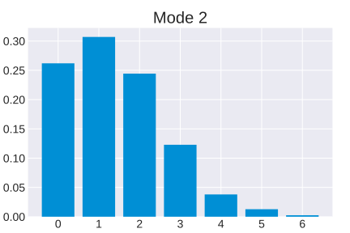

.. _tutorial:

Quantum teleportation tutorial
##############################

.. sectionauthor:: Josh Izaac <josh@xanadu.ai>

.. note:: This tutorial is also available in the form of an interactive Jupter Notebook :download:`QuantumTeleportation.ipynb <../../examples/QuantumTeleportation.ipynb>`

To see how to construct and simulate a simple continuous-variable (CV) quantum circuit in Strawberry Fields, let's consider the case of **state teleportation** (see the respective section on the :ref:`quantum algorithms <state_teleportation>` page for a more technical discussion).

Importing Strawberry Fields
============================

To start with, create a new text file with name :file:`teleport.py`, and open it in a text editor. The first thing we need to do is import Strawberry Fields; we do this with the following import statements:

.. code-block:: python

    #!/usr/bin/env python3
    import strawberryfields as sf
    from strawberryfields.ops import *
    from strawberryfields.utils import scale
    from numpy import pi, sqrt

The first import statement imports Strawberry Fields as ``sf``, allowing us to access the engine and backends. The second import statement imports all available CV gates into the global namespace, while the third import imports a prebuilt classical processing function from :mod:`strawberryfields.utils`, a module containing Strawberry Fields utilities and extensions. Finally, we import :math:`\pi` and the square root from ``NumPy`` so that we can pass angle parameters to gates such as beamsplitters, and perform some custom classical processing.

.. Finally, the third import imports various utilities we will need for teleportaton, in this case the :func:`~.convert` function.

Program initialization
======================

We can now initialize our quantum program by instantiating
a :class:`~.strawberryfields.program.Program` class:

``sf.Program(num_subsystems, name=None)``

where

* ``num_subsystems`` (*int*) is the number of modes we want to initialize in our quantum register
* ``name`` (*str*) is the name of the program (optional)

.. note::

    By default, Strawberry Fields uses the convention :math:`\hbar=2` for
    the commutation relation :math:`[\x,\p]=i\hbar`.

    Other conventions can also be chosen by setting the global variable
    :attr:`sf.hbar` at the beginning of a session.

    The value of :math:`\hbar` chosen modifies the application of the
    :class:`~.Xgate` and :class:`~.Zgate`, as well as the measurements returned
    by Homodyne measurement :class:`~.MeasureHomodyne`, so this must be taken
    into account if the value of :math:`\hbar` is modified. All other gates
    are unaffected.

    See :ref:`conventions` for more details.

Therefore, to initialize a program on three quantum registers, we write:

.. code-block:: python

    prog = sf.Program(3)

Circuit construction
=====================

To prepare states and apply gates to the quantum register ``q``, we must be inside the context of the program we initialized using the ``with`` statement. Everything within the program context is written using the :ref:`Blackbird quantum programming language <blackbird>`. For example, to construct the following state teleportation circuit

.. raw:: html

     

.. raw:: html

     

to teleport the coherent state :math:`\ket{\alpha}` where :math:`\alpha=1+0.5i`:

.. code-block:: python

    @sf.convert
    def custom(x):
        return -x*sqrt(2)

    with prog.context as q:
        # prepare initial states
        Coherent(1+0.5j) | q[0]
        Squeezed(-2) | q[1]
        Squeezed(2) | q[2]

        # apply gates
        BS = BSgate(pi/4, pi)
        BS | (q[1], q[2])
        BS | (q[0], q[1])

        # Perform homodyne measurements
        MeasureX | q[0]
        MeasureP | q[1]

        # Displacement gates conditioned on
        # the measurements
        Xgate(scale(q[0], sqrt(2))) | q[2]
        Zgate(custom(q[1])) | q[2]

A couple of things to note here:

* **The quantum register returned from the** ``prog.context`` **context manager is a sequence**. Individual modes can be accessed via standard Python indexing and slicing techniques.

..
    * **Preparing initial states, measurements, and gate operations all make use of the following syntax:**

..      ``Operation([arg1, arg2, ...]) | reg``

..      where the number of arguments depends on the specific operation, and ``reg`` is either a single mode or a sequence of modes, depending on how many modes the operation acts on. For a full list of operations and gates available, see the :ref:`quantum gates <gates>` documentation.

* **Every time a operation is applied it is added to the command queue**, ready to be simulated by the backend.

..

* **Operations must be applied in temporal order**. Different operation orderings can result in the same quantum circuit, providing the operations do not apply sequentially to the same mode. For example, we can permute the line containing ``MeasureX`` and ``MeasureP`` without changing the result.

..

* **Gates are standard Python objects, and can be treated as such**. In this case, since both beamsplitters use the same parameters, a single instance is being instantiated and stored under variable ``BS``.

..

* **The results of measured modes are passed to gates simply by passing the measured mode as an argument.** In order to perform additional classical processing to the measured mode, we can use the basic classical processing functions available in :mod:`strawberryfields.utils`; here we used the :func:`~.scale` function. In addition, we use the :func:`~strawberryfields.convert` decorator that we imported earlier to do more complicated classical processing, by converting our user-defined function, ``custom(x)``, to one that accepts quantum registers as arguments.

.. note:: By choosing a different phase for the 50-50 beamsplitter, that is, ``BSgate(pi/4,0)``, we can avoid having to negate the :class:`Zgate` correction! However, for the purposes of this tutorial, we will continue to use the currently defined beamsplitter so as to show how the :func:`~.convert` decorator works.

Executing the program
=====================

Once the program is constructed, we then must initialize an **engine**, which is responsible for executing
the program on a specified **backend** (which can be either a local simulator, or a
remote simulator/hardware device). Engines are initialized as follows:

``sf.Engine(backend, backend_options={})``

where

* ``backend``: a string or :class:`~.BaseBackend` object representing the Strawberry Fields backend we wish to use; we have the choice of two Fock backends [#]_, the NumPy based (``'fock'``) and Tensorflow (``'tf'``), and one Gaussian backend [#]_ (``'gaussian'``).

  This argument is *required* when creating the engine.

* ``backend_options`` is a dictionary containing options specific to the chosen backend.

  For more details on the technical differences between the backends, see :ref:`backends`.

Let's choose the Fock backend for this particular example. Since we are working in the Fock basis, we must also specify the Fock basis *cutoff dimension*; let's choose ``cutoff_dim=15``, such that a state :math:`\ket{\psi}` has approximation

.. math::

    \ket{\psi} = \sum_{n=0}^\infty c_n\ket{n} \approx \sum_{n=0}^{\texttt{cutoff_dim}-1} c_n\ket{n}

in our truncated Fock basis. We now have all the parameters ready to initialize the engine:

.. code-block:: python

    eng = sf.Engine('fock', backend_options={"cutoff_dim": 15})

.. warning::

    To avoid significant numerical error when working with the Fock backend, we need to make sure from now on that all initial states and gates we apply result in negligible amplitude in the Fock basis for Fock states :math:`\ket{n}, ~~n\geq \texttt{cutoff_dim}`.

    For example, to prepare a squeezed vacuum state in the :math:`x` quadrature with ``cutoff_dim=10``, a squeezing factor of :math:`r=1` provides an acceptable approximation, since :math:`|\braketD{n}{z}|^2<0.02` for :math:`n\geq 10`.

We can now execute our quantum program ``prog`` on the engine via the :func:`Engine.run` method:

.. code-block:: python

    result = eng.run(prog, run_options={shots=1, modes=None}, compile_options={})

The :meth:`eng.run <.LocalEngine.run>` method accepts the arguments:

.. 

* ``program``: The :class:`~.Program` to execute. 

..

* ``run_options``: A dictionary of keyword arguments to be passed to the backend when it prepares the returned measurement results and quantum state from a simulator backend. The available options depend on the backend in use; common arguments include:

    - ``shots``: A positive integer that specifies the number of times the program measurement evaluation is to be repeated. 
    - ``modes``: An optional list of integers that specifies which modes we wish the backend to return for the quantum state. If the state is a mixed state represented by a density matrix, then the backend will automatically perform a partial trace to return only the modes specified. Note that this only affects the returned state object---all modes remain in the backend circuit.

    - ``eval``, ``session``, and ``feed_dict``: These are special keyword arguments used by the TensorFlow backend. See the :ref:`machine_learning_tutorial` for details about what these are used for. 

..

* ``compile_options``: A dictionary of keyword arguments to be used for program compilation.
  To ensure the ``~.Program`` will run on the specified backend, the engine will perform
  **program compilation**, by calling the :meth:`~.Program.compile` method.

.. note::
   A ``shots`` value different than 1 is currently only supported for one specific case: the :code:`MeasureFock/Measure` operation executed on the Gaussian backend.

Other useful engine methods that can be called at any time include:

* :func:`eng.print_applied() <strawberryfields.engine.BaseEngine.print_applied>`: Prints all commands applied using :meth:`eng.run <strawberryfields.engine.LocalEngine.run>` since the last backend reset/initialisation.

  - This may differ from your original constructed program due to program compilation. As a result, this shows all applied gate decompositions, which may differ depending on the backend.

* :func:`eng.reset() <strawberryfields.engine.BaseEngine.reset>`: Resets the backend circuit to the vacuum state.

Results and visualization
==========================

The returned :class:`~Result` object provides several useful properties
for accessing the results of your program execution:

..

* ``results.state``: The quantum state object contains details and methods
  for manipulation of the final circuit state.

  Note that only local simulators will
  return a state object. Remote simulators and hardware backends will return
  :attr:`measurement samples <~.Result.samples>`, but the return value of ``state`` will be ``None``.

  Depending on backend used, the state returned might be a :class:`~.BaseFockState`, which represents the state using the Fock/number basis, or might be a :class:`~.BaseGaussianState`, which represents the state using Gaussian representation, as a vector of means and a covariance matrix. Many methods are provided for state manipulation, see :ref:`state_class` for more details.

..

* ``results.samples``: Measurement samples from any measurements performed.
  Returned measurement samples will have shape ``(modes,)``. If multiple
  shots are requested during execution, the returned measurement samples
  will instead have shape ``(shots, modes)``.

To analyze these results, it is convenient to now move to a Python console or interactive environment, such as `iPython <https://ipython.org/>`_ or `Jupyter Notebook <http://jupyter.org/>`_. In the following, Python input will be specified with the prompt ``>>>``, and output will follow.

Once the engine has been run, we can extract results of measurements and the quantum state from the circuit. Any measurements performed on a mode are stored attribute :attr:`result.samples <strawberryfields.engine.Result.samples>`:

.. code-block:: pycon

    >>> results.samples
    [2.9645296452964534, -2.9465294652946525, None]

If a mode has not been measured, this attribute simply returns ``None``.

In this particular example, we are using the Fock backend, and so the state that was returned by ``result.state`` is in the Fock basis. To double check this, we can inspect it with the ``print`` function:

.. code-block:: python

    >>> print(result.state)
    <FockState: num_modes=3, cutoff=15, pure=False, hbar=2.0>
    >>> state = result.state

In addition to the parameters we have already configured when creating and running the engine, the line ``pure=False``, indicates that this is a mixed state represented as a density matrix, and not a state vector.

To return the density matrix representing the Fock state, we can use the method :meth:`state.dm <.BaseFockState.dm>` [#]_. In this case, the density matrix has dimension

.. code-block:: pycon

    >>> state.dm().shape
    (15, 15, 15, 15, 15, 15)

Here, we use the convention that every pair of consecutive dimensions corresponds to a subsystem; i.e.,

.. math::

    \rho_{\underbrace{ij}_{q[0]}~\underbrace{kl}_{q[1]}~\underbrace{mn}_{q[2]}}

Thus we can calculate the reduced density matrix for mode ``q[2]``, :math:`\rho_2`:

.. code-block:: pycon

    >>> import numpy as np
    >>> rho2 = np.einsum('kkllij->ij', state.dm())
    >>> rho2.shape
    (15, 15)

.. note:: The Fock state also provides the method :meth:`~.BaseFockState.reduced_dm` for extracting the reduced density matrix automatically.

The diagonal values of the reduced density matrix contain the marginal Fock state probabilities :math:`|\braketD{i}{\rho_2}|^2,~~ 0\leq i\leq 14`:

.. code-block:: pycon

    >>> probs = np.real_if_close(np.diagonal(rho2))
    >>> print(probs)
    array([  2.61948280e-01,   3.07005910e-01,   2.44374603e-01,
         1.22884591e-01,   3.79861250e-02,   1.27283154e-02,
         2.40961681e-03,   1.79702250e-04,   1.10907533e-05,
         2.54431653e-05,   3.30439758e-05,   1.38338559e-05,
         4.72489428e-05,   2.11951333e-05,   9.01969688e-06])

We can then use a package such as matplotlib to plot the marginal Fock state probability distributions for the first 6 Fock states, for the teleported mode ``q[2]``:

.. code-block:: pycon

    >>> from matplotlib import pyplot as plt
    >>> plt.bar(range(7), probs[:7])
    >>> plt.xlabel('Fock state')
    >>> plt.ylabel('Marginal probability')
    >>> plt.title('Mode 2')
    >>> plt.show()

.. raw:: html

     

.. raw:: html

     

.. _fock_prob_tutorial:

Note that this information can also be extracted automatically via the Fock state method :meth:`~.BaseFockState.all_fock_probs`:

.. code-block:: pycon

    >>> fock_probs = state.all_fock_probs()
    >>> fock_probs.shape
    (15,15,15)
    >>> np.sum(fock_probs, axis=(0,1))
    array([  2.61948280e-01,   3.07005910e-01,   2.44374603e-01,
         1.22884591e-01,   3.79861250e-02,   1.27283154e-02,
         2.40961681e-03,   1.79702250e-04,   1.10907533e-05,
         2.54431653e-05,   3.30439758e-05,   1.38338559e-05,
         4.72489428e-05,   2.11951333e-05,   9.01969688e-06])

Full program
============

:file:`teleport.py`:

.. code-block:: python

    #!/usr/bin/env python3
    import strawberryfields as sf
    from strawberryfields.ops import *
    from strawberryfields.utils import scale
    from numpy import pi, sqrt

    prog = sf.Program(3)

    @sf.convert
    def custom(x):
        return -x*sqrt(2)

    with prog.context as q:
        # prepare initial states
        Coherent(1+0.5j) | q[0]
        Squeezed(-2) | q[1]
        Squeezed(2) | q[2]

        # apply gates
        BS = BSgate(pi/4, pi)
        BS | (q[1], q[2])
        BS | (q[0], q[1])

        # Perform homodyne measurements
        MeasureX | q[0]
        MeasureP | q[1]

        # Displacement gates conditioned on
        # the measurements
        Xgate(scale(q[0], sqrt(2))) | q[2]
        Zgate(custom(q[1])) | q[2]

    eng = sf.Engine('fock', backend_options={'cutoff_dim': 15})
    result = eng.run(prog)

.. rubric:: Footnotes

.. [#] Fock backends are backends which represent the quantum state and operations via the Fock basis. These can represent *all* possible CV states and operations, but also introduce numerical error due to truncation of the Fock space, and consume more memory.
.. [#] The Gaussian backend, due to its ability to represent states and operations as Gaussian objects/transforms in the phase space, consumes less memory and is less computationally intensive then the Fock backends. However, it cannot represent non-Gaussian operations and states (such as the cubic phase gate, and Fock states, amongst others). The only exception is Fock measurements. The Gaussian backend can simulate these, but it does not update the post-measurement quantum state, which would be non-Gaussian.
.. [#] If using the Gaussian backend, state methods and attributes available for extracting the state information include:

    * :meth:`~.BaseGaussianState.means` and :meth:`~.BaseGaussianState.cov` for returning the vector of means and the covariance matrix of the specified modes
    * :meth:`~.BaseState.fock_prob` for returning the probability that the photon counting pattern specified by ``n`` occurs
    * :meth:`~.BaseState.reduced_dm` for returning the reduced density matrix in the fock basis of mode ``n``
